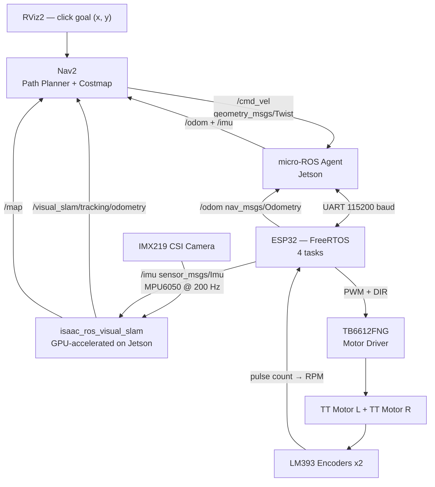

# slam-amr

Autonomous Mobile Robot with Visual-Inertial SLAM on NVIDIA Jetson Orin Nano Super.

**Ngoc Giang — Fulbright University Vietnam — June–August 2026**

## Input / Output

**Input:** a goal position — `(x, y)` coordinate on a map, clicked in RViz2 on the Jetson

**Output:** the robot physically drives itself to that position and stops, correcting its path in real time

Everything in between (SLAM, Nav2, PID, odometry) is the pipeline making that happen automatically.

## Business Context

Factory logistics in Vietnam is still largely manual. Mid-size manufacturers (electronics, garments, F&B) move parts between stations by hand or with basic forklifts. Imported AMRs (MiR, Omron) cost $20,000–$50,000 per unit — out of reach for most.

This project demonstrates a camera-based AMR (no lidar) built on commodity hardware. Replacing lidar with a $20 camera module cuts hardware cost significantly while GPU-accelerated SLAM on the Jetson maintains navigation quality. The Week 6 semantic navigation capability — navigate to a *detected object*, not a hardcoded coordinate — is the feature that makes this commercially relevant: a robot that can find a labeled bin or pallet without pre-programming exact positions.

Target users: Vietnamese manufacturers, logistics companies, and robotics startups who need autonomous internal transport but cannot justify imported AMR pricing.

## Performance Targets

| Metric | Target |
|--------|--------|
| Localization drift | <5 cm per 5 m travel |
| Navigation success rate | ≥80% in mapped environment |
| SLAM update rate | ≥30 Hz |
| /cmd_vel → motor response | <20 ms |
| Motor control loop (ESP32) | 100 Hz |

## Hardware

| Component | Role |
|-----------|------|
| Jetson Orin Nano Super (67 TOPS, 8 GB) | SLAM inference, navigation planning |
| IMX219 CSI camera | Primary vision sensor |
| ESP32 | Real-time motor control, sensor bridge |
| MPU6050 IMU | Visual-inertial sensor fusion |
| TB6612FNG motor driver | Dual H-bridge PWM control |
| LM393 encoders x2 | Wheel velocity feedback |
| TT DC motors x2 | Differential drive |
| Powerbank 20000mAh | 5V 3A USB output — main power source |

### Power Architecture — Known Issue + Planned Fix (2026-07-22)

**Problem found during F3 (PID) testing:** motor power (VM on TB6612FNG) was wired through the ESP32's own 5V pin, which itself was powered off the Jetson's USB port. Jetson USB ports are current-limited and were never meant to supply motor-driver current. Once PID pushed PWM higher during startup (highest current draw is near-stall, i.e. near 0 RPM), the shared 5V rail sagged enough to brown out the ESP32, which then rebooted, re-enabled the motor immediately in `app_main`, sagged again — a self-sustaining reset loop.

Separately, the Jetson's own supply (powerbank → PD Trigger → 12V barrel jack) tops out at ~12V/1.5A (~18W), well under the ~45W (19V/2.37A) the stock adapter is rated for — fine at idle, but a real risk once Week 3 GPU/SLAM workloads start drawing more.

**Planned fix — dedicated LiPo + buck-boost for the Jetson, decoupling it from the ESP32/motor power path:**

| Item | Spec to match | Search terms |
|------|----------------|--------------|
| LiPo battery pack | 4S, 5000mAh, XT60 connector + balance connector | `4S 5000mAh XT60 lipo` |
| Balance charger | Supports 4S balance charging | `lipo balance charger 4S` |
| Buck-boost converter | Adjustable output, input range covering 3S–6S (~9–25V), ≥5A rated output — built around the `LTC3780` controller IC | `LTC3780 buck boost converter module 10A` |
| LiPo safety bag | Fireproof charging/storage bag | `lipo safe bag fireproof` |

**Before connecting to the Jetson:** power the buck-boost from the LiPo alone (Jetson disconnected), measure output with a multimeter, trim to exactly 19V, confirm polarity — only then connect to the barrel jack. Same verify-before-connect discipline as the camera cable fix.

**Separately (not yet done):** motor VM still needs its own wire straight from a powerbank output, bypassing the ESP32 entirely — this is the fix that unblocks F3 testing; the LiPo/buck-boost work above is for the Jetson's own supply and is lower priority (works fine at today's idle-ish load, becomes urgent before Week 3 GPU workloads).

## Software Stack

| Layer | Technology |
|-------|-----------|
| OS | Ubuntu 22.04 (JetPack 6.2) |
| Middleware | ROS2 Humble |
| SLAM | Isaac ROS Visual SLAM (Elbrus, GPU-accelerated) |
| Navigation | Nav2 |
| MCU framework | ESP-IDF + FreeRTOS |
| MCU ROS bridge | micro-ROS for ESP-IDF |

## Motor Driver Schematic (TB6612FNG H-Bridge)


## Wiring Table (ESP32 ↔ TB6612FNG ↔ Motors ↔ Encoders ↔ IMU)

Motor driver path is wired and verified in `esp32/motor_f1` (F1 milestone). Encoders are wired (F2, in progress). IMU is wired but not read in firmware yet.

| ESP32 Pin | Connects To | Component | Purpose | Status |
|-----------|-------------|-----------|---------|--------|
| GPIO16 | PWMA | TB6612FNG | Motor A speed | ✅ wired |
| GPIO17 | PWMB | TB6612FNG | Motor B speed | ✅ wired |
| GPIO18 | AIN1 | TB6612FNG | Motor A direction | ✅ wired |
| GPIO19 | AIN2 | TB6612FNG | Motor A direction | ✅ wired |
| GPIO21 | BIN1 | TB6612FNG | Motor B direction | ✅ wired |
| GPIO22 | BIN2 | TB6612FNG | Motor B direction | ✅ wired |
| GPIO23 | STBY | TB6612FNG | Enable (HIGH = run) | ✅ wired |
| GPIO34 | OUT | LM393 Encoder L | Wheel L pulse count | ✅ wired |
| GPIO35 | OUT | LM393 Encoder R | Wheel R pulse count | ✅ wired |
| SDA / SCL | SDA / SCL | MPU6050 IMU | I2C sensor read | 🔌 wired, not read in firmware yet |
| 3V3 | VCC | TB6612FNG, both encoders, IMU | Logic power | ✅ wired |
| 5V | VM | TB6612FNG | Motor power (temporary passthrough) | ✅ wired |
| GND | GND | All above + powerbank | Common ground | ✅ wired |

**Downstream of TB6612FNG:** AO1/AO2 → Motor L (red/black) · BO1/BO2 → Motor R (red/black)

> Motor power (VM) currently passes through the ESP32's 5V pin — temporary until the powerbank feeds VM directly.

## System Pipeline



## ESP32 Firmware (FreeRTOS)

4 tasks pinned to cores:
- `imu_task` — I2C MPU6050 @ 200 Hz → `/imu`
- `encoder_task` — GPIO ISR on LM393 → RPM per wheel
- `pid_task` — velocity PID @ 100 Hz → PWM + `/odom`
- `uros_task` — micro-ROS spin, subscribes `/cmd_vel`

### F1 — Basic Motor Spin (`esp32/motor_f1`)

First firmware milestone for the drivetrain: prove the **ESP32 → TB6612FNG → TT motor**
path works. Fixed 50% PWM, both motors forward. No encoder, no PID yet (those are F2 / F3).

**Pin map (ESP32 38-pin DevKit → TB6612FNG)**

| ESP32 | TB6612FNG | Purpose |
|-------|-----------|---------|
| GPIO16 | PWMA | Motor A speed |
| GPIO17 | PWMB | Motor B speed |
| GPIO18 | AIN1 | Motor A direction |
| GPIO19 | AIN2 | Motor A direction |
| GPIO21 | BIN1 | Motor B direction |
| GPIO22 | BIN2 | Motor B direction |
| GPIO23 | STBY | Enable (HIGH = run) |
| 3V3 | VCC | Logic power |
| 5V | VM | Motor power (temporary: ESP32 5V passthrough) |
| GND | GND | Common ground (shared with powerbank) |

Motor L: red → AO1, black → AO2 · Motor R: red → BO1, black → BO2

**Build & flash**

```bash
cd esp32/motor_f1
idf.py build
sudo chmod 666 /dev/ttyUSB0
python -m esptool --chip esp32 --no-stub -p /dev/ttyUSB0 -b 115200 \
  write_flash --flash_mode dio --flash_size 2MB --flash_freq 40m \
  0x1000  build/bootloader/bootloader.bin \
  0x8000  build/partition_table/partition-table.bin \
  0x10000 build/motor_f1.bin
```

**Gotchas hit during F1 (so we don't repeat them)**

1. **Non-standard crystal.** This board's XTAL is not the usual 40 MHz.
   A default build gave garbled serial + a boot loop. Fix is baked into
   `sdkconfig.defaults` (`CONFIG_XTAL_FREQ_AUTO=y`).
2. **Stub flashing fails** with `Failed to start stub`. Flash with
   `--no-stub` at `-b 115200` (see command above).
3. **Predict-then-measure debugging.** Every pin has an *expected* voltage
   you can work out before touching the meter. Two points on the same wire
   showing different voltages ⇒ a broken/cold solder joint between them.

### F2 — Encoder RPM Read (`esp32/motor_f1`, merged with F1)

Second firmware milestone: `encoder_task` counts LM393 pulses via GPIO ISR
and computes RPM per wheel every 1s. Merged into the same project as F1
(not a separate one) because F3 (PID) needs both motor and encoder together
anyway. **Confirmed working on real hardware 2026-07-21** — hand-spun each
wheel, RPM tracked correctly and independently per side, returned to 0 at rest.

**Pin map (ESP32 → LM393 encoders)**

| ESP32 | Encoder | Purpose |
|-------|---------|---------|
| GPIO34 | Left OUT | Pulse count (input-only pin, no internal pull-up needed) |
| GPIO35 | Right OUT | Pulse count (input-only pin, no internal pull-up needed) |

**Test procedure** — verify the encoder alone before trusting it under PID:
comment out the `gpio_set_level(STBY_PIN, 1)` line in `app_main` so the
motors stay off, flash, then hand-spin each wheel and check the RPM printed
over serial looks sane. Only once confirmed, uncomment and let F1 + F2 run
together.

**Build, flash & monitor** — pipe the monitor output to a timestamped file
so a milestone test run isn't lost to terminal scrollback:

```bash
cd esp32/motor_f1
idf.py build
sudo chmod 666 /dev/ttyUSB0
python -m esptool --chip esp32 --no-stub -p /dev/ttyUSB0 -b 115200 \
  write_flash --flash_mode dio --flash_size 2MB --flash_freq 40m \
  0x1000  build/bootloader/bootloader.bin \
  0x8000  build/partition_table/partition-table.bin \
  0x10000 build/motor_f1.bin
idf.py -p /dev/ttyUSB0 monitor | tee "test_f2_$(date +%Y%m%d_%H%M).log"
```

**Gotchas hit during F2 (so we don't repeat them)**

1. **Wrong FreeRTOS macro.** `portMUX_INITIALIZE_DEFAULT` doesn't exist —
   the correct static spinlock initializer is `portMUX_INITIALIZER_UNLOCKED`.
   Compiler catches this immediately, but noting it here to save the lookup.
2. **Read-then-reset race condition.** The shared pulse counter is written
   by the ISR and read+reset by `encoder_task` every second. Without
   protection, a pulse that arrives between the read and the reset gets
   silently lost (the reset unconditionally zeroes the counter, discarding
   whatever was there). Fixed by wrapping the read+reset in
   `portENTER_CRITICAL`/`portEXIT_CRITICAL`.
3. **RPM is quantized in steps of 3.** With 20 slots/rev and a 1-second
   sample window, one pulse = `(1/20) * 60 = 3` RPM — every value in the
   test log is a multiple of 3. This isn't a bug; it's the sensor's actual
   resolution. **Relevant for F3:** at low speed this granularity can look
   like noise/jitter to a PID loop — if Kp tuning looks unexpectedly twitchy
   at low RPM, check whether it's real oscillation or just this quantization
   before assuming the gains are wrong.

**TODO before F3 (not done yet, don't build early):** write a small Python
script to parse a `test_f2_*.log` and plot RPM vs. time. Not worth it for F2
(the numbers were readable by eye), but PID tuning in F3 needs to see
step-response curves (overshoot, settling time) that aren't readable from
scrolling terminal output.

## Roadmap

| Week | Deliverable |
|------|-------------|
| 1 ✅ | micro-ROS hello world — ESP32 publishes ROS2 topic on Jetson |
| 2 | Motor driver + encoder wiring, ESP32 publishes `/odom` |
| 3 | IMX219 → isaac_ros_visual_slam → trajectory in RViz2 |
| 4 | PID velocity control, `/cmd_vel` → accurate robot movement |
| 5 | Nav2 + full end-to-end: camera → SLAM → Nav2 → motors autonomous |
| 6 | Semantic navigation: TensorRT object detection → navigate to target |
| 7 | Stress test, metrics, GitHub, demo video |
| 8 | Buffer / stretch goals (waypoint patrol, return-to-dock, multi-session map) |

## ROS2 Topic Interface (contract between ESP32 stack and Jetson stack)

This is the boundary the two halves of the team build against. Either side can develop independently as long as message type and topic name match — the ESP32 side doesn't need to know how `/cmd_vel` was computed, and the Jetson side doesn't need to know how `/odom` was computed.

| Topic | Message Type | Publisher | Subscriber |
|-------|-------------|-----------|------------|
| `/camera/image_raw` | `sensor_msgs/Image` | argus_camera (Jetson) | visual_slam (Jetson) |
| `/camera/camera_info` | `sensor_msgs/CameraInfo` | argus_camera (Jetson) | visual_slam (Jetson) |
| `/imu` | `sensor_msgs/Imu` | ESP32 (micro-ROS) | visual_slam (Jetson) |
| `/odom` | `nav_msgs/Odometry` | ESP32 (micro-ROS) | Nav2 (Jetson) |
| `/visual_slam/tracking/odometry` | `nav_msgs/Odometry` | visual_slam (Jetson) | Nav2 (Jetson) |
| `/map` | `nav_msgs/OccupancyGrid` | visual_slam (Jetson) | Nav2 costmap (Jetson) |
| `/cmd_vel` | `geometry_msgs/Twist` | Nav2 (Jetson) | ESP32 (micro-ROS) |
| `/tf` | `tf2_msgs/TFMessage` | visual_slam + Nav2 (Jetson) | All nodes |
| `/goal_pose` | `geometry_msgs/PoseStamped` | RViz2 / mission (Jetson) | Nav2 (Jetson) |

## Team & Work Split

Two-person team. Split is drawn along one line: **does this task require physically touching the robot?** Alex (remote) cannot solder, reseat a cable, or hear a motor to tune PID — so anything requiring hands-on-hardware iteration stays with the on-site owner. Anything that is pure software/config, or can be developed and dry-run against logged/simulated data (e.g. a `ros2 bag` recording, or mock topic publishers), is fair game to build remotely and integrate later.

**Ngoc Giang (vịt) — on-site, owns the physical stack:**
- ESP32 firmware requiring real hardware feedback: `encoder_task`, `pid_task` (PID tuning needs to hear/see the real motor respond — cannot be tuned blind), odometry math, `uros_task`
- All hardware bring-up: soldering, wiring, camera mounting/calibration, IMU mounting
- On-device validation: carrying the robot to check SLAM trajectory (Week 3), physically measuring drift (Week 7)

**Alex (remote) — owns the software/config stack, buildable without the physical robot:**
- Isaac ROS Docker setup + `visual_slam` launch/config (Week 3) — can be built and dry-run against a sample rosbag or public IMX219 dataset before the real camera feed is ready
- Nav2 stack: YAML config, planner selection, costmap layers (Week 5) — develop against simulated `/odom` + `/map` data, tune for real once camera/SLAM (vịt's side) is live
- Semantic navigation: train/export detection model, write TensorRT inference node (Week 6) — training and most integration work doesn't need the physical robot, only final on-device deployment does
- Tooling: evaluation/metrics scripts (Week 7), RViz2 dashboard config, repo docs

**Handoff points:** the [ROS2 Topic Interface](#ros2-topic-interface-contract-between-esp32-stack-and-jetson-stack) table above is the contract — build against topic name + message type, not against the other person's implementation. When a physical milestone lands (e.g. `/odom` is real and flowing), that's the signal to switch from mock data to live integration testing together.

## Repository Structure

```
slam-amr/
├── esp32/
│   └── microros_hello/
│       └── microros_hello.c   # Week 1: micro-ROS publisher with auto-reconnect
└── README.md
```

## PID Control Block Diagram


## Open Questions / Next Session (2026-07-23)

**Camera debugging — resolved but lesson not yet locked in.**

`nvgstcapture-1.0` crashed (`Elements could not link encoder & parser`, core dump) before capturing anything. Teammate's fix: skip that tool entirely and drive `gst-launch-1.0` directly — `nvarguscamerasrc ! nvvidconv ! autovideosink` connected fine (`CONSUMER: Producer has connected`), and a `nvjpegenc` still-capture pipeline completed cleanly. So the IMX219/Argus camera itself was never broken — the crash was isolated to `nvgstcapture-1.0`'s H.264 encoder-linking step, a stage the SLAM pipeline doesn't even need (OpenCV/visual_slam wants raw frames, not encoded video).

**Question to answer out loud next session, before writing any camera capture code for Week 3:** why did dropping to a minimal explicit `gst-launch-1.0` pipeline reveal that the camera was fine all along, and what does that imply about how to debug the next weird failure in this pipeline (capture / SLAM / serial / servo) — test each stage in isolation before assuming the earliest/loudest error is the root cause?
