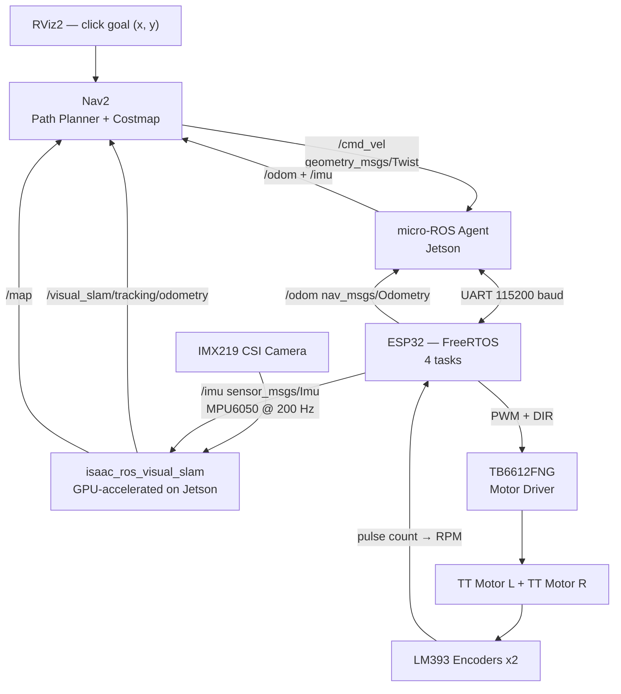

# slam-amr

Autonomous Mobile Robot with Visual-Inertial SLAM on NVIDIA Jetson Orin Nano Super.

**Ngoc Giang — Fulbright University Vietnam — June–August 2026**

## Input / Output

**Input:** a goal position — `(x, y)` coordinate on a map, clicked in RViz2 on the Jetson

**Output:** the robot physically drives itself to that position and stops, correcting its path in real time

Everything in between (SLAM, Nav2, PID, odometry) is the pipeline making that happen automatically.

## Business Context

Factory logistics in Vietnam is still largely manual. Mid-size manufacturers (electronics, garments, F&B) move parts between stations by hand or with basic forklifts. Imported AMRs (MiR, Omron) cost $20,000–$50,000 per unit — out of reach for most.

This project demonstrates a camera-based AMR (no lidar) built on commodity hardware. Replacing lidar with a $20 camera module cuts hardware cost significantly while GPU-accelerated SLAM on the Jetson maintains navigation quality. The Week 6 semantic navigation capability — navigate to a *detected object*, not a hardcoded coordinate — is the feature that makes this commercially relevant: a robot that can find a labeled bin or pallet without pre-programming exact positions.

Target users: Vietnamese manufacturers, logistics companies, and robotics startups who need autonomous internal transport but cannot justify imported AMR pricing.

## Performance Targets

| Metric | Target |
|--------|--------|
| Localization drift | <5 cm per 5 m travel |
| Navigation success rate | ≥80% in mapped environment |
| SLAM update rate | ≥30 Hz |
| /cmd_vel → motor response | <20 ms |
| Motor control loop (ESP32) | 100 Hz |

## Hardware

| Component | Role |
|-----------|------|
| Jetson Orin Nano Super (67 TOPS, 8 GB) | SLAM inference, navigation planning |
| IMX219 CSI camera | Primary vision sensor |
| ESP32 | Real-time motor control, sensor bridge |
| MPU6050 IMU | Visual-inertial sensor fusion |
| TB6612FNG motor driver | Dual H-bridge PWM control |
| LM393 encoders x2 | Wheel velocity feedback |
| TT DC motors x2 | Differential drive |
| Powerbank 20000mAh | 5V 3A USB output — main power source |

## Software Stack

| Layer | Technology |
|-------|-----------|
| OS | Ubuntu 22.04 (JetPack 6.2) |
| Middleware | ROS2 Humble |
| SLAM | Isaac ROS Visual SLAM (Elbrus, GPU-accelerated) |
| Navigation | Nav2 |
| MCU framework | ESP-IDF + FreeRTOS |
| MCU ROS bridge | micro-ROS for ESP-IDF |

## Motor Driver Schematic (TB6612FNG H-Bridge)


## Wiring Table (ESP32 ↔ TB6612FNG ↔ Motors ↔ Encoders ↔ IMU)

Motor driver path is wired and verified in `esp32/motor_f1` (F1 milestone). Encoders are wired (F2, in progress). IMU is wired but not read in firmware yet.

| ESP32 Pin | Connects To | Component | Purpose | Status |
|-----------|-------------|-----------|---------|--------|
| GPIO16 | PWMA | TB6612FNG | Motor A speed | ✅ wired |
| GPIO17 | PWMB | TB6612FNG | Motor B speed | ✅ wired |
| GPIO18 | AIN1 | TB6612FNG | Motor A direction | ✅ wired |
| GPIO19 | AIN2 | TB6612FNG | Motor A direction | ✅ wired |
| GPIO21 | BIN1 | TB6612FNG | Motor B direction | ✅ wired |
| GPIO22 | BIN2 | TB6612FNG | Motor B direction | ✅ wired |
| GPIO23 | STBY | TB6612FNG | Enable (HIGH = run) | ✅ wired |
| GPIO34 | OUT | LM393 Encoder L | Wheel L pulse count | ✅ wired |
| GPIO35 | OUT | LM393 Encoder R | Wheel R pulse count | ✅ wired |
| SDA / SCL | SDA / SCL | MPU6050 IMU | I2C sensor read | 🔌 wired, not read in firmware yet |
| 3V3 | VCC | TB6612FNG, both encoders, IMU | Logic power | ✅ wired |
| 5V | VM | TB6612FNG | Motor power (temporary passthrough) | ✅ wired |
| GND | GND | All above + powerbank | Common ground | ✅ wired |

**Downstream of TB6612FNG:** AO1/AO2 → Motor L (red/black) · BO1/BO2 → Motor R (red/black)

> Motor power (VM) currently passes through the ESP32's 5V pin — temporary until the powerbank feeds VM directly.

## System Pipeline



## ESP32 Firmware (FreeRTOS)

4 tasks pinned to cores:
- `imu_task` — I2C MPU6050 @ 200 Hz → `/imu`
- `encoder_task` — GPIO ISR on LM393 → RPM per wheel
- `pid_task` — velocity PID @ 100 Hz → PWM + `/odom`
- `uros_task` — micro-ROS spin, subscribes `/cmd_vel`

### F1 — Basic Motor Spin (`esp32/motor_f1`)

First firmware milestone for the drivetrain: prove the **ESP32 → TB6612FNG → TT motor**
path works. Fixed 50% PWM, both motors forward. No encoder, no PID yet (those are F2 / F3).

**Pin map (ESP32 38-pin DevKit → TB6612FNG)**

| ESP32 | TB6612FNG | Purpose |
|-------|-----------|---------|
| GPIO16 | PWMA | Motor A speed |
| GPIO17 | PWMB | Motor B speed |
| GPIO18 | AIN1 | Motor A direction |
| GPIO19 | AIN2 | Motor A direction |
| GPIO21 | BIN1 | Motor B direction |
| GPIO22 | BIN2 | Motor B direction |
| GPIO23 | STBY | Enable (HIGH = run) |
| 3V3 | VCC | Logic power |
| 5V | VM | Motor power (temporary: ESP32 5V passthrough) |
| GND | GND | Common ground (shared with powerbank) |

Motor L: red → AO1, black → AO2 · Motor R: red → BO1, black → BO2

**Build & flash**

```bash
cd esp32/motor_f1
idf.py build
sudo chmod 666 /dev/ttyUSB0
python -m esptool --chip esp32 --no-stub -p /dev/ttyUSB0 -b 115200 \
  write_flash --flash_mode dio --flash_size 2MB --flash_freq 40m \
  0x1000  build/bootloader/bootloader.bin \
  0x8000  build/partition_table/partition-table.bin \
  0x10000 build/motor_f1.bin
```

**Gotchas hit during F1 (so we don't repeat them)**

1. **Non-standard crystal.** This board's XTAL is not the usual 40 MHz.
   A default build gave garbled serial + a boot loop. Fix is baked into
   `sdkconfig.defaults` (`CONFIG_XTAL_FREQ_AUTO=y`).
2. **Stub flashing fails** with `Failed to start stub`. Flash with
   `--no-stub` at `-b 115200` (see command above).
3. **Predict-then-measure debugging.** Every pin has an *expected* voltage
   you can work out before touching the meter. Two points on the same wire
   showing different voltages ⇒ a broken/cold solder joint between them.

## Roadmap

| Week | Deliverable |
|------|-------------|
| 1 ✅ | micro-ROS hello world — ESP32 publishes ROS2 topic on Jetson |
| 2 | Motor driver + encoder wiring, ESP32 publishes `/odom` |
| 3 | IMX219 → isaac_ros_visual_slam → trajectory in RViz2 |
| 4 | PID velocity control, `/cmd_vel` → accurate robot movement |
| 5 | Nav2 + full end-to-end: camera → SLAM → Nav2 → motors autonomous |
| 6 | Semantic navigation: TensorRT object detection → navigate to target |
| 7 | Stress test, metrics, GitHub, demo video |
| 8 | Buffer / stretch goals (waypoint patrol, return-to-dock, multi-session map) |

## Repository Structure

```
slam-amr/
├── esp32/
│   └── microros_hello/
│       └── microros_hello.c   # Week 1: micro-ROS publisher with auto-reconnect
└── README.md
```

## PID Control Block Diagram


