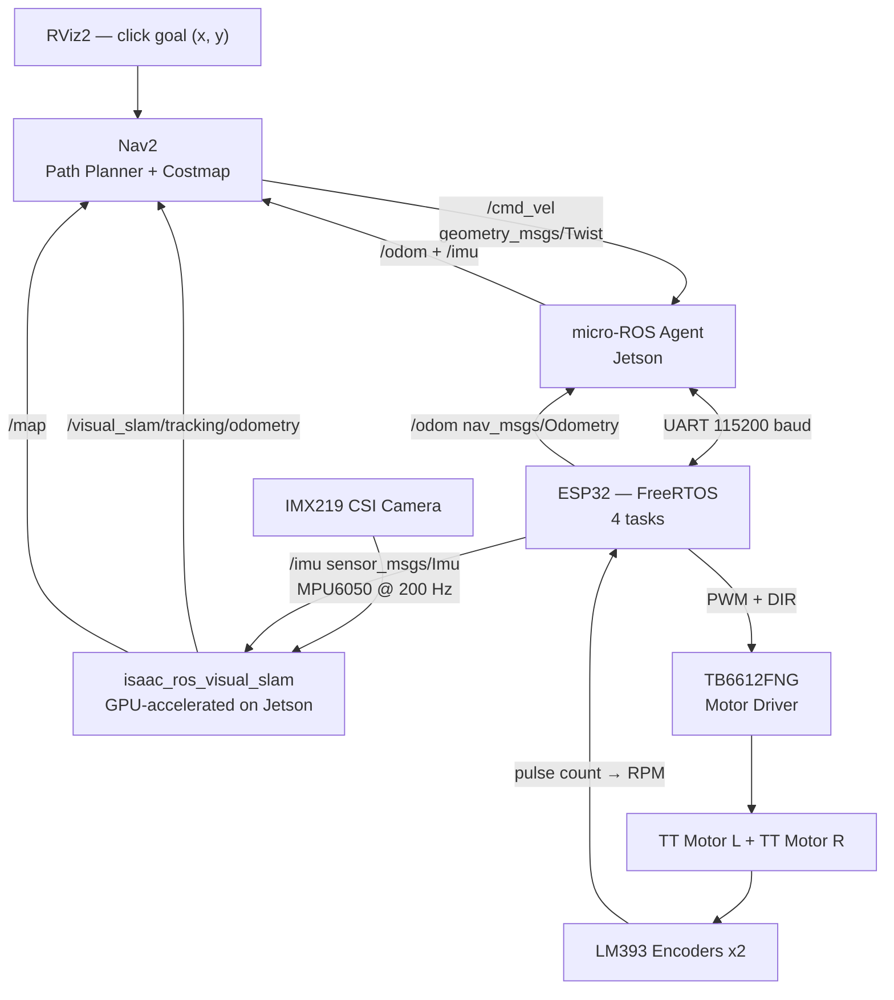

# slam-amr

Autonomous Mobile Robot with Visual-Inertial SLAM on NVIDIA Jetson Orin Nano Super.

**Ngoc Giang — Fulbright University Vietnam — June–August 2026**

## Input / Output

**Input:** a goal position — `(x, y)` coordinate on a map, clicked in RViz2 on the Jetson

**Output:** the robot physically drives itself to that position and stops, correcting its path in real time

Everything in between (SLAM, Nav2, PID, odometry) is the pipeline making that happen automatically.

## Business Context

Factory logistics in Vietnam is still largely manual. Mid-size manufacturers (electronics, garments, F&B) move parts between stations by hand or with basic forklifts. Imported AMRs (MiR, Omron) cost $20,000–$50,000 per unit — out of reach for most.

This project demonstrates a camera-based AMR (no lidar) built on commodity hardware. Replacing lidar with a $20 camera module cuts hardware cost significantly while GPU-accelerated SLAM on the Jetson maintains navigation quality. The Week 6 semantic navigation capability — navigate to a *detected object*, not a hardcoded coordinate — is the feature that makes this commercially relevant: a robot that can find a labeled bin or pallet without pre-programming exact positions.

Target users: Vietnamese manufacturers, logistics companies, and robotics startups who need autonomous internal transport but cannot justify imported AMR pricing.

## Performance Targets

| Metric | Target |
|--------|--------|
| Localization drift | <5 cm per 5 m travel |
| Navigation success rate | ≥80% in mapped environment |
| SLAM update rate | ≥30 Hz |
| /cmd_vel → motor response | <20 ms |
| Motor control loop (ESP32) | 100 Hz |

## Hardware

| Component | Role |
|-----------|------|
| Jetson Orin Nano Super (67 TOPS, 8 GB) | SLAM inference, navigation planning |
| IMX219 CSI camera | Primary vision sensor |
| ESP32 | Real-time motor control, sensor bridge |
| MPU6050 IMU | Visual-inertial sensor fusion |
| TB6612FNG motor driver | Dual H-bridge PWM control |
| LM393 encoders x2 | Wheel velocity feedback |
| TT DC motors x2 | Differential drive |
| Powerbank 20000mAh | 5V 3A USB output — main power source |

## Software Stack

| Layer | Technology |
|-------|-----------|
| OS | Ubuntu 22.04 (JetPack 6.2) |
| Middleware | ROS2 Humble |
| SLAM | Isaac ROS Visual SLAM (Elbrus, GPU-accelerated) |
| Navigation | Nav2 |
| MCU framework | ESP-IDF + FreeRTOS |
| MCU ROS bridge | micro-ROS for ESP-IDF |

## System Pipeline



## ESP32 Firmware (FreeRTOS)

4 tasks pinned to cores:
- `imu_task` — I2C MPU6050 @ 200 Hz → `/imu`
- `encoder_task` — GPIO ISR on LM393 → RPM per wheel
- `pid_task` — velocity PID @ 100 Hz → PWM + `/odom`
- `uros_task` — micro-ROS spin, subscribes `/cmd_vel`

## Roadmap

| Week | Deliverable |
|------|-------------|
| 1 ✅ | micro-ROS hello world — ESP32 publishes ROS2 topic on Jetson |
| 2 | Motor driver + encoder wiring, ESP32 publishes `/odom` |
| 3 | IMX219 → isaac_ros_visual_slam → trajectory in RViz2 |
| 4 | PID velocity control, `/cmd_vel` → accurate robot movement |
| 5 | Nav2 + full end-to-end: camera → SLAM → Nav2 → motors autonomous |
| 6 | Semantic navigation: TensorRT object detection → navigate to target |
| 7 | Stress test, metrics, GitHub, demo video |
| 8 | Buffer / stretch goals (waypoint patrol, return-to-dock, multi-session map) |

## Repository Structure

```
slam-amr/
├── esp32/
│   └── microros_hello/
│       └── microros_hello.c   # Week 1: micro-ROS publisher with auto-reconnect
└── README.md
```

## PID Control Block Diagram


