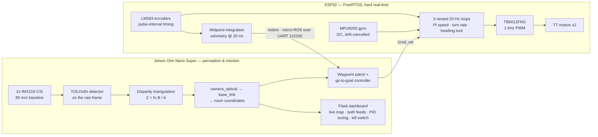

# Search-and-Rescue AMR — camera-only target localisation on a Jetson

> **English** (default) · [Tiếng Việt](README.vi.md)

An autonomous mobile robot that is placed in the corner of a room, switched on, and left alone.
It drives a patrol route by itself, watches the room with two inward-angled cameras, recognises
the target it was trained to find, works out how far away that target is from geometry alone,
and reports where it is — as a live map and as walking directions from the spot the operator
put the robot down.

**No LiDAR. No SLAM. No external localisation.** Two USD 20 camera modules, wheel encoders and
a gyroscope.

**End-to-end target position error while the robot is driving: 1 cm / 16 cm / 4 cm** at
tape-measured ground truths of 0.31 m / 0.90 m / 1.04 m.

`Jetson Orin Nano Super` · `ESP32 / FreeRTOS` · `ROS 2 Humble` · `micro-ROS` · `OpenCV` ·
`YOLOv8` · `Flask` — ~5,100 lines of Python across 24 files, ~1,800 lines of C, 258 commits,
June–September 2026.

---

## What it does

```
 place robot in a corner  →  patrol the perimeter  →  detect the target in both cameras
          →  triangulate its distance  →  fuse with odometry into room coordinates
                    →  report position on a live dashboard
```

A full mission ran end to end on real hardware on 2026-09-06.

<!-- TODO: drop a demo GIF / video link here — it is the single highest-value addition to this README -->

## Results

| | Result | How it was measured |
|---|---|---|
| **Target position error, end to end, robot driving** | **1 cm / 16 cm / 4 cm** at 0.31 / 0.90 / 1.04 m | tape measure, three placements, full mission each time |
| Stereo distance accuracy alone, robot stationary | ~10 % over 0.3–1.0 m | ruler sweep, four distances |
| Stereo calibration quality | 0.33 px reprojection error | `cv2.stereoCalibrate`, 20 checkerboard pairs |
| Calibrated baseline vs. physical | 85.40 mm vs. 83 mm | calibration output vs. calipers |
| Odometry / control loop rate | 20 Hz pose, three nested 20 Hz loops, 1 kHz PWM | firmware |
| Vision loop rate | 0.54 Hz against a 5 Hz target | measured — the system's weakest number, see [Phase 2](docs/PHASE2_PLAN.md) |

The first row is the number this project should be judged on: it is the only one that includes
every layer at once. It is reported *separately* from the second row on purpose — the stereo
sensor alone and the complete system are different claims, and conflating them would be
cherry-picking. Every measurement, including the ones that came out badly, is in
[`docs/BENCHMARKS.md`](docs/BENCHMARKS.md).

## System architecture

Two computers, split by what each is good at: a microcontroller with hard real-time guarantees
does the motor control, a GPU machine does the vision. They talk over one UART.


```mermaid
flowchart LR
    subgraph ESP32["ESP32 — FreeRTOS, hard real-time"]
        ENC["LM393 encoders<br/>pulse-interval timing"] --> PID["3 nested 20 Hz loops<br/>PI speed · turn rate · heading lock"]
        IMU["MPU6050 gyro<br/>I2C, drift-cancelled"] --> PID
        PID --> PWM["TB6612FNG<br/>1 kHz PWM"] --> MOT["TT motors x2"]
        ENC --> ODO["Midpoint-integration<br/>odometry @ 20 Hz"]
    end

    subgraph JETSON["Jetson Orin Nano Super — perception & mission"]
        CAM["2x IMX219 CSI<br/>85 mm baseline"] --> DET["YOLOv8n detector<br/>on the raw frame"]
        DET --> STEREO["Disparity triangulation<br/>Z = fx·B / d"]
        STEREO --> WORLD["camera_optical → base_link<br/>→ room coordinates"]
        WORLD --> MISSION["Waypoint patrol +<br/>go-to-goal controller"]
        WORLD --> DASH["Flask dashboard<br/>live map · both feeds · PID tuning · kill switch"]
    end

    ODO -->|"/odom · micro-ROS over UART 115200"| MISSION
    MISSION -->|"/cmd_vel"| PID
```

## What I built, layer by layer

An autonomy stack has four layers. This project built all four, joined them, and — more
unusually — measured the join.

| Layer | Built | Code |
|---|---|---|
| **Perception** | Stereo calibration from scratch (capture → `stereoCalibrate` → `stereoRectify` → rectification maps); YOLOv8n target detector trained and deployed on the Jetson GPU; distance by disparity triangulation; a second independent estimate by dense stereo (`StereoSGBM` → `reprojectImageTo3D`); camera-optical → `base_link` → world transform | [`jetson/calibration/`](jetson/calibration), [`jetson/mission/`](jetson/mission) |
| **State estimation** | Dead-reckoning odometry with midpoint integration on the MCU; gyro-fused heading over I2C; pose published at 20 Hz; a room frame with a fixed offset from the odometry origin | [`esp32/motor_f1/main/motor_f1.c`](esp32/motor_f1/main/motor_f1.c) |
| **Control** | Three nested 20 Hz loops on the ESP32 — per-wheel PI speed control, turn-rate correction, gyro heading lock — over 1 kHz PWM; a go-to-goal waypoint controller with turn-in-place above ~50° of heading error; proportional ramp-down on turns; a motor kill switch on the driver's standby pin | [`esp32/motor_f1/`](esp32/motor_f1), [`jetson/mission/`](jetson/mission) |
| **Integration** | micro-ROS over UART at 115200 (`/odom` in, `/cmd_vel` out, diagnostics and live PID gains alongside); TF tree `odom → base_link → camera_optical` feeding RViz2; a Flask + canvas operator dashboard with live map, robot pose, both camera feeds, detection overlays, runtime PID tuning and the kill switch | [`jetson/mission/search_and_rescue.py`](jetson/mission/search_and_rescue.py) |

## Engineering highlights

Four of the thirteen failures that taught this project something. Each came off real hardware;
the full set with evidence is in [`docs/PROJECT_SUMMARY.md`](docs/PROJECT_SUMMARY.md) §4.

**A model's training distribution is part of the geometry pipeline.**
The detector worked well in single-camera testing and collapsed once the stereo pipeline went
live. Not a model problem: it had been trained exclusively on raw, distorted frames, and the
stereo pipeline was feeding it *rectified* ones — geometrically altered images outside its
training distribution. The fix was to move the transform, not retrain. Detection now runs on the
raw frame, and only the resulting box's four corner points are mapped into rectified space via
`cv2.undistortPoints(..., R, P)` — the same rectification the image remap already uses, applied
to four points instead of two million pixels. The model stays inside its training distribution;
the disparity maths still gets exact epipolar-aligned coordinates.

**A sensor's resolution can defeat any controller gain.**
The wheel speed controller oscillated permanently. It was never a tuning problem: RPM was
measured by counting pulses on a 20-slot disc over a 50 ms window, which quantises RPM into
60 RPM steps — and the target sat exactly between two measurable levels, so the controller could
only ever read ±30 RPM, never "at target." No value of Kp or Ki fixes that. Fixed by changing the
*measurement*: timing the microseconds between pulses instead of counting pulses per window
removed the quantisation floor without lowering the loop rate.

**Silent failures hide in the semantics of your middleware.**
`PointCloud2` messages never rendered in RViz2 while `Marker` messages in the same frame rendered
fine, with no error anywhere. The MCU was publishing `Odometry` with an all-zero header stamp, so
the `odom → base_link` transform was pinned at "time 0" in the tf2 buffer. Markers are placed
directly in a frame and need no lookup; point clouds must be transformed *at their own timestamp*,
so every lookup failed — silently. The generalisation: **when one consumer of a shared resource
works and another does not, the difference between what they require is where the bug is.**

**Passive dense stereo structurally fails on textureless objects.**
Dense stereo returned three discrete, repeating distance clusters for a *static* target at 1.3 m
while single-point triangulation held steady at 1.30 m from the same detection box. The cause is
not tuning: block matching compares small image patches, and a patch of smooth yellow plastic is
indistinguishable from every other patch of smooth yellow plastic, so the matcher locked onto the
textured background at the box edges. Proven directly — the eroded centre region produced *zero*
confident matches on every failing frame. NVIDIA's own Isaac ROS ESS documents the same limitation,
and the industry answer is hardware: the RealSense D435 beats 2 % at 2 m from a *narrower* baseline
by projecting an IR pattern, i.e. by adding the texture passive stereo needs. A missing hardware
capability, not a coding mistake.

## What I evaluated and deliberately did not ship

Both were brought up on real hardware first, then cut with the reasons recorded. Scope decisions,
not gaps.

| | Why it was cut |
|---|---|
| **Nav2** | `RegulatedPurePursuitController` accepted goals and produced valid plans but silently never published a single `/cmd_vel`. Isolated to that plugin by swapping in DWB as a differential test, which worked immediately. Root cause never found — DEBUG logging is compiled out of the apt binaries. A known, bounded room does not need live path planning. |
| **cuVSLAM / visual SLAM** | Unresolved pose-scale problem: positions diverged or settled into implausible bands. Multiple hypotheses tested and disproven. Hardcoded waypoints plus gyro-fused odometry cover a known room. |
| **Isaac ROS stereo depth** | Needs the full Docker container and a rectified stereo launch that claims the cameras exclusively, so it cannot coexist with this node's own capture — and runs at ~1–1.5 Hz on this class of Jetson. |

## Repository layout

```
.
├── esp32/                      # Firmware (ESP-IDF + FreeRTOS)
│   ├── motor_f1/               #   motor control, encoders, IMU, odometry, micro-ROS
│   └── microros_hello/         #   minimal micro-ROS publisher (bring-up reference)
├── jetson/                     # Everything that runs on the Jetson (ROS 2 Humble)
│   ├── mission/                #   search-and-rescue mission node + Flask dashboard
│   ├── calibration/            #   stereo capture, calibration, camera_info export
│   ├── object_detection/       #   single-camera detection test rig
│   ├── dataset_collection/     #   record → extract frames → assemble YOLO dataset
│   ├── training/               #   YOLOv8n fine-tuning
│   ├── slam/                   #   Isaac ROS visual SLAM launch files (evaluated, not shipped)
│   ├── nav2/                   #   Nav2 closed-loop MVP (evaluated, not shipped)
│   └── tools/                  #   diagnostics: IMU logging, micro-ROS agent, drive tests
├── docs/                       # Written record
│   ├── PROJECT_SUMMARY.md      #   what was built, measured and learned  <- start here
│   ├── BENCHMARKS.md           #   every measured number, by layer
│   ├── FULL_REPORT.md          #   the formal report
│   ├── PHASE2_PLAN.md          #   next phase: GPU perception, measured against this baseline
│   └── images/                 #   schematics and block diagrams
├── data/                       # Datasets and captures (see data/README.md)
└── archive/                    # Superseded material, kept for provenance
```

## Running it

Needs the physical robot: Jetson Orin Nano Super (JetPack 6.x, ROS 2 Humble), two IMX219 CSI
cameras on a calibrated 85 mm baseline, an ESP32 on `/dev/ttyUSB0`, and the drivetrain described
in [`docs/FULL_REPORT.md`](docs/FULL_REPORT.md) §3.

```bash
# 1. Flash the firmware (from a machine with ESP-IDF + the micro-ROS component installed)
cd esp32/motor_f1 && idf.py build flash monitor
# NOTE: a failed build does not stop `flash` from re-uploading the last good .bin --
# always read the build output before trusting a live test.

# 2. Bring up the ESP32 <-> Jetson bridge (on the Jetson)
./jetson/tools/start_microros_agent.sh
ros2 topic echo /odom      # confirm pose is live before anything else

# 3. Calibrate the stereo rig (once per physical change to the rig)
python3 jetson/calibration/capture_stereo_pairs.py
python3 jetson/calibration/stereo_calibrate.py

# 4. Run the mission
python3 jetson/mission/search_and_rescue.py
# dashboard: http://<jetson-hostname>.local:8080
```

**Placement matters more than position.** The reported target location is computed relative to
the start pose, so the start offset cancels out exactly — putting the robot down 5 cm off changes
nothing. A *rotational* error does not cancel and cannot be corrected, because the gyro zeroes its
heading at whatever angle the robot was set down at: at 1.7 m range, 5° of placement yaw displaces
the reported target by ~15 cm. Measure from the side wall to the front and rear of the chassis and
equalise; do not judge by eye.

## Documentation

| Document | What it is for |
|---|---|
| [`docs/PROJECT_SUMMARY.md`](docs/PROJECT_SUMMARY.md) | The consolidated view: results, the data behind them, thirteen engineering insights. **Start here.** |
| [`docs/BENCHMARKS.md`](docs/BENCHMARKS.md) | Every measured number, by layer, marked measured / configured / never measured. |
| [`docs/FULL_REPORT.md`](docs/FULL_REPORT.md) | The formal written report, including hardware and wiring. |
| [`docs/PHASE2_PLAN.md`](docs/PHASE2_PLAN.md) | The next 11 weeks: replace CPU perception with NVIDIA's GPU stack and measure the difference against this baseline. |
| [`archive/README_devlog.md`](archive/README_devlog.md) | The original dated session log — every bug, root cause and dead end as it happened. |

## Status and honest limitations

Working and measured end to end. Known gaps, all recorded rather than hidden:

- **Odometry drift over a loop has never been measured**, nor has straight-line lateral drift or
  post-fix turn accuracy. State estimation and control — the layers everything else sits on — are
  the least measured, while perception, the layer that *felt* hardest, is the best measured. Worth
  naming, because that bias is not obvious from the inside.
- **Every figure is a single placement**, not a mean over repeated trials.
- **The vision loop runs at 0.54 Hz** against a 5 Hz target; dense stereo costs ~1 s/frame on CPU.
  Closing that is the point of [Phase 2](docs/PHASE2_PLAN.md).
- The detector has never been formally evaluated on a labelled holdout set.

## About

Built by **Ngoc Giang (vịt)** — CS/Engineering, Fulbright University Vietnam — June–September 2026.

A two-person project, split by whether a task requires physically touching the robot: I own the
on-site stack (firmware, hardware bring-up, calibration, PID tuning, the mission node and the
vision pipeline); my teammate Alex works remotely on configuration, tooling and documentation.

📫 giang.hoang.230105@student.fulbright.edu.vn
