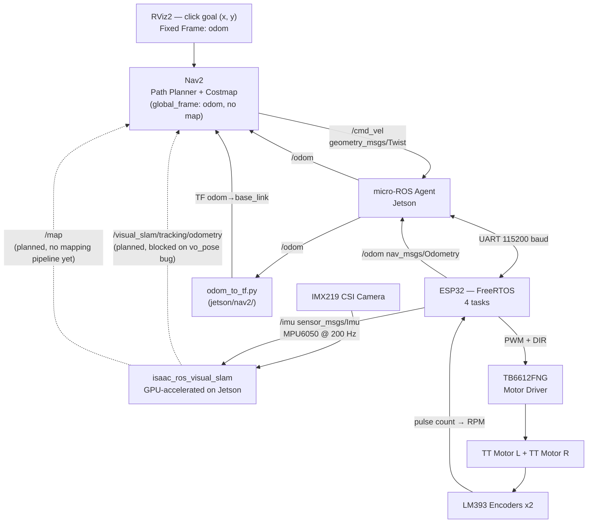

# slam-amr

Autonomous Mobile Robot with Visual-Inertial SLAM on NVIDIA Jetson Orin Nano Super.

**Ngoc Giang — Fulbright University Vietnam — June–August 2026**

## Input / Output

**Input:** a goal position — `(x, y)` coordinate on a map, clicked in RViz2 on the Jetson

**Output:** the robot physically drives itself to that position and stops, correcting its path in real time

Everything in between (SLAM, Nav2, PID, odometry) is the pipeline making that happen automatically.

## Business Context

Factory logistics in Vietnam is still largely manual. Mid-size manufacturers (electronics, garments, F&B) move parts between stations by hand or with basic forklifts. Imported AMRs (MiR, Omron) cost $20,000–$50,000 per unit — out of reach for most.

This project demonstrates a camera-based AMR (no lidar) built on commodity hardware. Replacing lidar with a $20 camera module cuts hardware cost significantly while GPU-accelerated SLAM on the Jetson maintains navigation quality. The Week 6 semantic navigation capability — navigate to a *detected object*, not a hardcoded coordinate — is the feature that makes this commercially relevant: a robot that can find a labeled bin or pallet without pre-programming exact positions.

Target users: Vietnamese manufacturers, logistics companies, and robotics startups who need autonomous internal transport but cannot justify imported AMR pricing.

## Performance Targets

| Metric | Target |
|--------|--------|
| Localization drift | <5 cm per 5 m travel |
| Navigation success rate | ≥80% in mapped environment |
| SLAM update rate | ≥30 Hz |
| /cmd_vel → motor response | <20 ms |
| Motor control loop (ESP32) | 100 Hz |

## Hardware

| Component | Role |
|-----------|------|
| Jetson Orin Nano Super (67 TOPS, 8 GB) | SLAM inference, navigation planning |
| IMX219 CSI camera | Primary vision sensor |
| ESP32 | Real-time motor control, sensor bridge |
| MPU6050 IMU | Visual-inertial sensor fusion |
| TB6612FNG motor driver | Dual H-bridge PWM control |
| LM393 encoders x2 | Wheel velocity feedback |
| TT DC motors x2 | Differential drive |
| Powerbank 20000mAh (PD) | Jetson power via PD Trigger → 12V barrel jack — see [Power Architecture](#power-architecture--known-issue--planned-fix-2026-07-22), LiPo+buck-boost upgrade still pending |
| 1x 3.7V Li-ion cell + boost converter | Motor VM (TB6612FNG) — replaced the dedicated powerbank after its mid-run cutoff bug, confirmed running cleanly under real PID load. **TODO: record cell capacity + boost converter model/rating here.** |

### Power Architecture — Known Issue + Planned Fix (2026-07-22)

**Problem found during F3 (PID) testing:** motor power (VM on TB6612FNG) was wired through the ESP32's own 5V pin, which itself was powered off the Jetson's USB port. Jetson USB ports are current-limited and were never meant to supply motor-driver current. Once PID pushed PWM higher during startup (highest current draw is near-stall, i.e. near 0 RPM), the shared 5V rail sagged enough to brown out the ESP32, which then rebooted, re-enabled the motor immediately in `app_main`, sagged again — a self-sustaining reset loop.

Separately, the Jetson's own supply (powerbank → PD Trigger → 12V barrel jack) tops out at ~12V/1.5A (~18W), well under the ~45W (19V/2.37A) the stock adapter is rated for — fine at idle, but a real risk once Week 3 GPU/SLAM workloads start drawing more.

**Planned fix — dedicated LiPo + buck-boost for the Jetson, decoupling it from the ESP32/motor power path:**

| Item | Spec to match | Search terms |
|------|----------------|--------------|
| LiPo battery pack | 4S, 5000mAh, XT60 connector + balance connector | `4S 5000mAh XT60 lipo` |
| Balance charger | Supports 4S balance charging | `lipo balance charger 4S` |
| Buck-boost converter | Adjustable output, input range covering 3S–6S (~9–25V), ≥5A rated output — built around the `LTC3780` controller IC | `LTC3780 buck boost converter module 10A` |
| LiPo safety bag | Fireproof charging/storage bag | `lipo safe bag fireproof` |

**Before connecting to the Jetson:** power the buck-boost from the LiPo alone (Jetson disconnected), measure output with a multimeter, trim to exactly 19V, confirm polarity — only then connect to the barrel jack. Same verify-before-connect discipline as the camera cable fix.

**✅ Fixed 2026-07-24:** motor VM now has its own wire straight from a powerbank output, bypassing the ESP32 entirely. Confirmed on real hardware — F3 (PID) ran continuously through the PWM ramp with no brownout/reset loop. The Jetson's own LiPo/buck-boost supply (above) is still open — lower priority, becomes urgent before Week 3 GPU workloads.

**🔶 Issue found 2026-07-27, RESOLVED by switching power source (not by isolating the original root cause):** the powerbank then dedicated to VM cut its own output off mid-run during PID testing. Root cause was never conclusively isolated (candidates: no-load auto-shutoff tripping when PWM sags low, or over-current protection tripping on motor inrush current — a `MIN_SAFE_PWM` floor added as a first attempt ruled out the low-current theory but didn't resolve it). **Decided against sharing the Jetson's own Anker PD powerbank for VM too** — even a well-regulated multi-port bank shares one internal battery/BMS, so a motor inrush spike on one port risks sagging the other, reintroducing the exact ESP32-brownout failure mode from the 2026-07-22 bug but on the Jetson instead (much higher stakes).

**✅ Current fix:** motor VM now runs off a dedicated **1x 3.7V Li-ion cell + boost converter** instead of any powerbank. Confirmed running cleanly under real motor/PID load, no mid-run cutoff — Jetson and motor VM remain on physically separate power sources, as planned. The Jetson's own supply (powerbank → PD Trigger → barrel jack) is unchanged and still the lower-priority open item below.

## Software Stack

| Layer | Technology |
|-------|-----------|
| OS | Ubuntu 22.04 (JetPack 6.2) |
| Middleware | ROS2 Humble |
| SLAM | Isaac ROS Visual SLAM (Elbrus, GPU-accelerated) |
| Navigation | Nav2 |
| MCU framework | ESP-IDF + FreeRTOS |
| MCU ROS bridge | micro-ROS for ESP-IDF |

## Motor Driver Schematic (TB6612FNG H-Bridge)


## Wiring Table (ESP32 ↔ TB6612FNG ↔ Motors ↔ Encoders ↔ IMU)

Motor driver path is wired and verified in `esp32/motor_f1` (F1 milestone). Encoders are wired (F2, in progress). IMU is wired but not read in firmware yet.

| ESP32 Pin | Connects To | Component | Purpose | Status |
|-----------|-------------|-----------|---------|--------|
| GPIO16 | PWMA | TB6612FNG | Motor A speed | ✅ wired |
| GPIO17 | PWMB | TB6612FNG | Motor B speed | ✅ wired |
| GPIO18 | AIN1 | TB6612FNG | Motor A direction | ✅ wired |
| GPIO19 | AIN2 | TB6612FNG | Motor A direction | ✅ wired |
| GPIO21 | BIN1 | TB6612FNG | Motor B direction | ✅ wired |
| GPIO22 | BIN2 | TB6612FNG | Motor B direction | ✅ wired |
| GPIO23 | STBY | TB6612FNG | Enable (HIGH = run) | ✅ wired |
| GPIO34 | OUT | LM393 Encoder L | Wheel L pulse count | ✅ wired |
| GPIO35 | OUT | LM393 Encoder R | Wheel R pulse count | ✅ wired |
| GPIO26 | SDA | MPU6050 IMU | I2C data line | 🔌 wired, not read in firmware yet |
| GPIO25 | SCL | MPU6050 IMU | I2C clock line | 🔌 wired, not read in firmware yet |
| 3V3 | VCC | TB6612FNG, both encoders, IMU | Logic power | ✅ wired |
| Li-ion cell (3.7V) → boost converter (direct) | VM | TB6612FNG | Motor power | ✅ wired — no longer via ESP32 5V (fixed 2026-07-24), no longer a powerbank either (switched off the cutoff-prone VM powerbank, see Power Architecture) |
| GND | GND | All above + powerbank | Common ground | ✅ wired |

**Downstream of TB6612FNG:** AO1/AO2 → Motor L (red/black) · BO1/BO2 → Motor R (red/black)

## System Pipeline


```mermaid
flowchart TD
    A["RViz2 — click goal (x, y)\nFixed Frame: odom"] --> B["Nav2\nPath Planner + Costmap\n(global_frame: odom, no map)"]
    C["IMX219 CSI Camera"] --> D["isaac_ros_visual_slam\nGPU-accelerated on Jetson"]
    D -.->|"/visual_slam/tracking/odometry\n(planned, blocked on vo_pose bug)"| B
    D -.->|"/map\n(planned, no mapping pipeline yet)"| B
    B -->|"/cmd_vel\ngeometry_msgs/Twist"| F["micro-ROS Agent\nJetson"]
    F <-->|"UART 115200 baud"| G["ESP32 — FreeRTOS\n4 tasks"]
    G -->|"PWM + DIR"| H["TB6612FNG\nMotor Driver"]
    H --> I["TT Motor L + TT Motor R"]
    I --> J["LM393 Encoders x2"]
    J -->|"pulse count → RPM"| G
    G -->|"/odom nav_msgs/Odometry"| F
    G -->|"/imu sensor_msgs/Imu\nMPU6050 @ 200 Hz"| D
    F -->|"/odom"| K["odom_to_tf.py\n(jetson/nav2/)"]
    K -->|"TF odom→base_link"| B
    F -->|"/odom"| B
```

## ESP32 Firmware (FreeRTOS)

4 tasks pinned to cores:
- `imu_task` — I2C MPU6050 @ 200 Hz → `/imu`
- `encoder_task` — GPIO ISR on LM393 → RPM per wheel
- `pid_task` — velocity PID @ 100 Hz → PWM + `/odom`
- `uros_task` — micro-ROS spin, subscribes `/cmd_vel`

### F1 — Basic Motor Spin (`esp32/motor_f1`)

First firmware milestone for the drivetrain: prove the **ESP32 → TB6612FNG → TT motor**
path works. Fixed 50% PWM, both motors forward. No encoder, no PID yet (those are F2 / F3).

**Pin map (ESP32 38-pin DevKit → TB6612FNG)**

| ESP32 | TB6612FNG | Purpose |
|-------|-----------|---------|
| GPIO16 | PWMA | Motor A speed |
| GPIO17 | PWMB | Motor B speed |
| GPIO18 | AIN1 | Motor A direction |
| GPIO19 | AIN2 | Motor A direction |
| GPIO21 | BIN1 | Motor B direction |
| GPIO22 | BIN2 | Motor B direction |
| GPIO23 | STBY | Enable (HIGH = run) |
| 3V3 | VCC | Logic power |
| GND | GND | Common ground (shared with motor power source) |

> Motor power (VM) no longer connects to the ESP32 — wired directly to its own supply as of 2026-07-24, now a dedicated Li-ion cell + boost converter (see [Power Architecture](#power-architecture--known-issue--planned-fix-2026-07-22) for the full fix history, including the powerbank that was tried and replaced in between).

Motor L: red → AO1, black → AO2 · Motor R: red → BO1, black → BO2

**Build & flash**

```bash
cd esp32/motor_f1
idf.py build
sudo chmod 666 /dev/ttyUSB0
python -m esptool --chip esp32 --no-stub -p /dev/ttyUSB0 -b 115200 \
  write_flash --flash_mode dio --flash_size 2MB --flash_freq 40m \
  0x1000  build/bootloader/bootloader.bin \
  0x8000  build/partition_table/partition-table.bin \
  0x10000 build/motor_f1.bin
```

**Gotchas hit during F1 (so we don't repeat them)**

1. **Non-standard crystal.** This board's XTAL is not the usual 40 MHz.
   A default build gave garbled serial + a boot loop. Fix is baked into
   `sdkconfig.defaults` (`CONFIG_XTAL_FREQ_AUTO=y`).
2. **Stub flashing fails** with `Failed to start stub`. Flash with
   `--no-stub` at `-b 115200` (see command above).
3. **Predict-then-measure debugging.** Every pin has an *expected* voltage
   you can work out before touching the meter. Two points on the same wire
   showing different voltages ⇒ a broken/cold solder joint between them.

### F2 — Encoder RPM Read (`esp32/motor_f1`, merged with F1)

Second firmware milestone: `encoder_task` counts LM393 pulses via GPIO ISR
and computes RPM per wheel every 1s. Merged into the same project as F1
(not a separate one) because F3 (PID) needs both motor and encoder together
anyway. **Confirmed working on real hardware 2026-07-21** — hand-spun each
wheel, RPM tracked correctly and independently per side, returned to 0 at rest.

**Pin map (ESP32 → LM393 encoders)**

| ESP32 | Encoder | Purpose |
|-------|---------|---------|
| GPIO34 | Left OUT | Pulse count (input-only pin, no internal pull-up needed) |
| GPIO35 | Right OUT | Pulse count (input-only pin, no internal pull-up needed) |

**Test procedure** — verify the encoder alone before trusting it under PID:
comment out the `gpio_set_level(STBY_PIN, 1)` line in `app_main` so the
motors stay off, flash, then hand-spin each wheel and check the RPM printed
over serial looks sane. Only once confirmed, uncomment and let F1 + F2 run
together.

**Build, flash & monitor** — pipe the monitor output to a timestamped file
so a milestone test run isn't lost to terminal scrollback:

```bash
cd esp32/motor_f1
idf.py build
sudo chmod 666 /dev/ttyUSB0
python -m esptool --chip esp32 --no-stub -p /dev/ttyUSB0 -b 115200 \
  write_flash --flash_mode dio --flash_size 2MB --flash_freq 40m \
  0x1000  build/bootloader/bootloader.bin \
  0x8000  build/partition_table/partition-table.bin \
  0x10000 build/motor_f1.bin
idf.py -p /dev/ttyUSB0 monitor | tee "test_f2_$(date +%Y%m%d_%H%M).log"
```

**Gotchas hit during F2 (so we don't repeat them)**

1. **Wrong FreeRTOS macro.** `portMUX_INITIALIZE_DEFAULT` doesn't exist —
   the correct static spinlock initializer is `portMUX_INITIALIZER_UNLOCKED`.
   Compiler catches this immediately, but noting it here to save the lookup.
2. **Read-then-reset race condition.** The shared pulse counter is written
   by the ISR and read+reset by `encoder_task` every second. Without
   protection, a pulse that arrives between the read and the reset gets
   silently lost (the reset unconditionally zeroes the counter, discarding
   whatever was there). Fixed by wrapping the read+reset in
   `portENTER_CRITICAL`/`portEXIT_CRITICAL`.
3. **RPM is quantized in steps of 3.** With 20 slots/rev and a 1-second
   sample window, one pulse = `(1/20) * 60 = 3` RPM — every value in the
   test log is a multiple of 3. This isn't a bug; it's the sensor's actual
   resolution. **Relevant for F3:** at low speed this granularity can look
   like noise/jitter to a PID loop — if Kp tuning looks unexpectedly twitchy
   at low RPM, check whether it's real oscillation or just this quantization
   before assuming the gains are wrong.

**TODO (still not done, still worth doing):** write a small Python script to
parse a saved monitor log and plot RPM/PWM/pose vs. time. F3 debugging today
confirmed the need (see "F3 PID debugging chain" and "F5" below) — reading
scrolling terminal numbers by eye was the actual bottleneck more than once.
Workaround used instead: `idf.py monitor`'s built-in `Ctrl+T Ctrl+L` log-to-file
(reliable over SSH, unlike piping through `tee` — see Lessons Learned), then
`scp` the file back for offline analysis. A real parser/plotter is still the
better fix, just not built yet.

### F3 — PID Velocity Control (`esp32/motor_f1`, merged with F1/F2)

**Status: done, 2026-07-27.** P+I control per wheel (Kd deliberately skipped —
see "F3 PID debugging chain" in Lessons Learned for why), anti-windup, a
cumulative-distance wheel-sync trim, and a real compile-breaking bug fix
(macro used before its `#define` — see Lessons Learned) all landed the same
day. Full blow-by-blow of the 4 stacked bugs found before any of this worked
is in Lessons Learned; short version: encoder ISR noise, RPM measurement
quantization (twice — once from the sampling window, once from pulse-counting
vs. period-measurement), a safety PWM floor fighting the controller, and a
target value with no torque margin. None of them were "the gains are wrong."

### F4 — Odometry (`esp32/motor_f1`)

**Status: done, 2026-07-27.** Computes `x`, `y`, `theta` from wheel pulses
each control cycle — per-wheel distance from pulse count × wheel
circumference, robot-center distance = average of the two wheels, heading
change = difference ÷ wheelbase. Uses midpoint integration (average of old
and new heading for the position update, not just the old heading) since a
turning robot's heading can shift enough within one 200ms cycle to visibly
bias x/y otherwise. Measured constants: wheel diameter 6cm, wheelbase 10cm.
Test procedure: push the robot ~1m in a straight line, confirm the logged
`x` reads close to 1.0 (and `y`/`theta` stay near 0).

### F5 — micro-ROS: `/cmd_vel` in, `/odom` out (`esp32/motor_f1`)

**Status: builds, connects, and the core `/cmd_vel` → drive → `/odom` pipeline is CONFIRMED working (2026-07-27) — but one real issue is still open (see below), don't call this fully done yet.**

`uros_task` mirrors the proven `esp32/microros_hello.c` connect/retry pattern
(Week 1): subscribes `geometry_msgs/Twist` on `/cmd_vel`, converts
`linear.x`/`angular.z` into per-wheel target RPM via differential-drive
inverse kinematics (replacing the old hardcoded `TARGET_RPM` test value),
and publishes `nav_msgs/Odometry` on `/odom` at 10Hz using F4's pose. Two
safety/correctness details worth knowing:

- **Watchdog:** if no `/cmd_vel` message has arrived within 1s (agent crash,
  USB unplugged, Jetson down), commanded velocity is forced to 0 — a lost
  connection must mean "stop", never "keep driving on the last command."
  A related real bug (`MIN_SAFE_PWM` overriding this and never letting the
  robot actually stop) was found and fixed live — see Lessons Learned.
- **Wheel-sync gating:** the F3 sync-trim logic (see above) is now gated to
  only run when `|angular.z| < 0.05` (straight-line motion) — an intentional
  turn deliberately makes the two wheels travel different distances, and
  without this gate sync would fight every turn command.

**Known interface conflict:** micro-ROS's custom transport and the normal
debug console (`idf.py monitor` / `ESP_LOGI`) both use UART0 — once
`uros_task`'s transport is active, the familiar `RPM L=... R=...` log lines
stop being readable there (confirmed live: sharing the wire actively
corrupts both streams, not just makes one unreadable). All console logging
is muted via `esp_log_level_set` once the transport is set. Debugging F5 is
via the Jetson side instead: `ros2 topic echo /odom`, `ros2 topic pub
/cmd_vel`, and a new `/esp32_diag` topic (see open issue below) — per the
ROS2 Topic Interface contract further down.

**Confirmed working end-to-end (2026-07-27):** `ros2 topic pub /cmd_vel` from
the Jetson made the robot actually drive, and `ros2 topic echo /odom` showed
real position/heading tracking the motion (e.g. x=0.097m, y=0.189m, ~38°
turn after a short drive). This is the core F5 deliverable and it works.

**OPEN ISSUE, not yet resolved — resume here next session:** during a
longer, real drive test (both wheels actually running, not just the earlier
stationary connectivity check), `/odom`'s position was observed climbing
then resetting back toward ~0 repeatedly, and the agent log showed the
micro-ROS `client_key` change (i.e. a new session) at least once during
testing — strong evidence the ESP32 itself is rebooting mid-drive, not just
dropping the micro-ROS link. A `/esp32_diag` topic was added (publishes
`esp_reset_reason()` read at boot, since normal console logging is muted)
specifically to answer "was that a brownout?" without needing the serial
monitor - **but the diagnostic test to actually check this hasn't been
completed cleanly yet** (two different physical disturbances - an
accidental cable unplug, and closing the agent terminal by mistake -
interrupted data collection both times). Also seen once: one wheel
spinning while the other stayed stopped, then swapping - possibly related,
possibly a separate symptom of the same underlying power issue.
**Next session: rerun the drive test with `/esp32_diag` open in a terminal
the whole time, nobody touching any cables, and watch whether it flips to
`BROWNOUT` at the same moment `/odom` resets.** If confirmed, the real fix
is almost certainly a power-delivery problem under combined 2-motor current
draw (see "Power Architecture" section above for the project's known power
topology) - not a firmware bug to keep patching blind.

**Setup needed to build this project fresh on a new checkout** (already done
on the current Jetson working copy, but not automatic - the micro-ROS
library itself is a large local build cache, intentionally NOT committed to
git): copy `micro_ros_espidf_component` from an already-working micro-ROS
project (e.g. `~/esp/microros_hello/components/`) into
`esp32/motor_f1/components/`, then `idf.py build`. Everything this project
specifically needs on top of that (the custom transport `.c`/`.h`, a minimal
`Kconfig.projbuild`, `main/CMakeLists.txt`'s `SRCS` list) is already
committed - see Lessons Learned for the exact chain of build errors this
took to work out, in case a future fresh setup hits the same ones.

## Nav2 — Closed-Loop MVP (`jetson/nav2/`)

**Status: CONFIRMED WORKING on real hardware as of 2026-08-07.** Goal: send a goal pose, robot drives there via `/cmd_vel`. Runs **natively on the Jetson's ROS2 Humble** (`ros-humble-navigation2`), fully outside the Isaac ROS Docker container — Nav2 only depends on `/odom`, which is already published natively by the ESP32/micro-ROS side, so this whole stage is decoupled from the fragile Isaac ROS environment.

**Two separate, unrelated bugs stacked on the first real hardware test — both had to be fixed before anything moved:**
1. **Software: `RegulatedPurePursuitController` (RPP) never published a single `/cmd_vel` message.** Goals were accepted, `planner_server` produced a valid global `/plan` every cycle (confirmed via `ros2 topic echo /plan` — sane, smooth poses), but `controller_server` never emitted `/local_plan` or `/cmd_vel` — no exception, no error logged, even with `use_collision_detection: false`. **Root cause not found** (DEBUG-level logging is compiled out of the apt-installed binaries, so internal reasoning couldn't be inspected). Fixed by swapping the `FollowPath` plugin to `dwb_core::DWBLocalPlanner` as a differential test — DWB immediately published real, continuously-updating `/cmd_vel` values, isolating the fault to RPP specifically (not shared Nav2/costmap/TF infrastructure). **`nav2_params.yaml` now uses DWB, not RPP — don't switch back without new evidence of what was actually wrong.**
2. **Hardware: motor power (VM) was never actually connected this session.** Independently of the software bug, the TB6612FNG's `VM` pin had no 5V connected at all — confirmed once the software side was proven live (`/cmd_vel` had real nonzero values, robot still didn't move) and a multimeter check on `AO1`/`AO2` read 0.5-0.7V, matching this project's now-repeated "floating node / loose connection" signature (see encoder VCC and motor-output cold-joint entries below). Fixed by reseating the VM connector. **Lesson: the two symptoms (no `/cmd_vel` at all vs. `/cmd_vel` present but robot still not moving) look identical from "robot doesn't move" alone — always check the ROS-level signal (`ros2 topic echo /cmd_vel`) before assuming a hardware fault, and vice versa.**

**Deliberate scope decisions for this MVP (see also the ROS2 Topic Interface status column above):**
- **`global_frame: odom`, no map, no AMCL.** There's no map to localize against (the `vo_pose`/cuVSLAM scale bug below is deliberately deferred, not fixed) and no lidar on this robot for AMCL's `LaserScan` input anyway, even if a map existed. **Known, accepted limitation:** odom drift is unbounded over time with nothing correcting it, so the longer the robot runs, the more the planner's idea of "where things are" silently diverges from reality. Fine for a short single-goal test drive; not for long/repeated runs without real localization.
- **No obstacle costmap layer** — only an inflation layer around the robot's own footprint. Semantic/obstacle detection is later-roadmap scope. **This MVP does not avoid obstacles.**
- **`odom_to_tf.py` bridge node, added because of a real gap found during design:** the ESP32 firmware (`esp32/motor_f1/main/motor_f1.c`) publishes `/odom` as a plain `nav_msgs/Odometry` topic only — it never broadcasts the `odom → base_link` TF. Nav2's costmaps and controller read robot pose from TF, not from the topic directly, so without this bridge Nav2 fails immediately on any goal with "Could not get robot pose." This is a small, separate Jetson-side ROS2 node (not a colcon package — run by file path like everything else in `jetson/`), deliberately not added to the ESP32 firmware itself to keep the firmware hardware-facing-only.

**Files:**
- `nav2_params.yaml` — `controller_server` (**DWB Local Planner** — swapped from Regulated Pure Pursuit, see bug #1 above), `planner_server` (NavFn), `behavior_server` (spin/backup/wait recoveries), `bt_navigator`, local + global costmap (both rolling-window, `global_frame: odom`), `lifecycle_manager`. Speeds kept conservative (`max_vel_x: 0.15` m/s) relative to the ~0.3 m/s already proven safe on real hardware during the `vo_pose` `/cmd_vel` trials — raise once more of this MVP is proven out. `robot_radius: 0.10` is a conservative estimate from the measured wheel diameter/wheelbase (6cm / 10cm), not yet measured off the real chassis.
- `nav2_launch.py` — launches `odom_to_tf.py` + the 4 Nav2 lifecycle nodes together.
- `odom_to_tf.py` — the TF bridge described above.

**To run (confirmed working 2026-08-07):**
```bash
sudo apt install ros-humble-navigation2 ros-humble-nav2-bringup   # if not already present
# bring up micro-ROS agent + ESP32 first so /odom is live -- and physically
# double-check the VM connector is fully seated before trusting a "no movement"
# result means anything (see bug #2 above)
ros2 launch jetson/nav2/nav2_launch.py
```
Send a goal (RViz2's "2D Goal Pose" tool with Fixed Frame `odom`, or directly via CLI):
```bash
ros2 action send_goal /navigate_to_pose nav2_msgs/action/NavigateToPose \
  "{pose: {header: {frame_id: 'odom'}, pose: {position: {x: 0.5, y: 0.0, z: 0.0}, orientation: {w: 1.0}}}}"
```
Confirm both the terminal (`Goal finished with status: SUCCEEDED`) and the robot physically driving there — don't trust the status alone.

**Handoff note for whoever picks this up next (see Team & Work Split below):** the original work split assigned "Nav2 stack: YAML config, planner selection, costmap layers" to Alex for Week 5. This MVP was built ahead of that, directly against the `/odom` contract, to unblock a closed-loop demo sooner given the project's compressed timeline. Coordinate before extending it (e.g. adding the obstacle layer, tuning the controller) to avoid duplicate work.

## Search & Rescue Mission MVP (`jetson/mission/`)

**Status: two parallel threads. Vision (2026-08-26)** — two-camera stereo confirmed working end-to-end on real hardware, GPU inference fixed, model retrained on a larger public dataset; one false-positive bug still open. **Motor/nav (2026-08-27)** — motor-direction and PID-authority blockers both fixed and confirmed live in the real room; room-orientation and a full measured perimeter loop still being validated. Goal: robot patrols a known, bounded room's perimeter, detects a duck somewhere near the center, and reports its estimated grid-cell location — a scoped-down "search and rescue" framing (patrol + detect + report), pitched by teammate Alex as a more concrete, demoable narrative than the original generic semantic-navigation goal.

**Deliberately does not use Nav2 or VSLAM — cut for the same reason: untested/fragile infrastructure that a small, known room doesn't actually need.**
- **No Nav2/costmap/planner.** The room is fixed and known in advance, so instead of live path planning, the route is a hardcoded waypoint list (the 4 corners, inset 0.3m from the walls for clearance, plus back to start) driven by a simple go-to-goal controller: at each tick, compute heading error and distance to the current waypoint from `/odom`, turn in place if badly misaligned, otherwise drive forward while correcting heading, advance to the next waypoint once close enough. This reuses `/odom`'s gyro-fused heading (see the IMU entry below) directly — no separate localization system.
- **No VSLAM.** cuVSLAM still has an unresolved ~3-5x pose scale bug (see the Week 3 Lessons Learned entries below) — routing navigation through it would import that risk for no benefit, since wheel+gyro odometry alone is accurate enough over the short distances this room's loop covers.
- **Real two-camera stereo (not monocular, not Isaac ROS Docker) for duck distance**, upgraded 2026-08-26 from the original monocular known-height approach specifically because that approach doesn't generalize to unknown objects in a real deployment. Both cameras (8.3cm apart, same rigid mount) detect the duck independently; distance comes from the pixel disparity between the two detections (`distance = fx_rect * baseline_m / disparity_px`), reusing the same `stereo_calibration.npz` from the original forward-facing calibration — no recalibration needed after later remounts (yaw rotation, height change, 180° roll), since a whole-rig rigid transform preserves the cameras' calibration relative to *each other*. Old monocular version kept as `search_and_rescue_monocular_backup.py`.
- **Detection runs on the raw camera frame, not the rectified one** — `best.pt` was trained exclusively on raw, distorted single-camera frames; feeding it the undistorted/rectified frame instead put it outside its training distribution and caused a real accuracy collapse once the stereo pipeline went live. Each detected box's corners are mapped into rectified pixel space afterward (`cv2.undistortPoints`) so the disparity/distance math is unaffected — full bug-chain writeup, confirmed with real hardware numbers, below.

**Camera mounted at a fixed 45° angle (not forward-facing) — a real gap caught by testing the physical setup, not by writing code first.** While hugging the perimeter, the robot's forward direction points *along* the wall, not toward the room's center where the duck actually is — a straight-ahead camera would mostly look down the wall and rarely catch it. Rotating the camera 45° toward the room's interior fixes this without needing a second camera; the fixed offset is folded directly into the bearing math (`CAMERA_BEARING_OFFSET_RAD`).

**Room-orientation on the dashboard map is still being validated live (open as of 2026-08-27).** The map always draws the robot's boot position/heading at canvas bottom-left-facing-right — this is a relative-odometry + canvas-drawing convention, true regardless of which real corner the robot is actually placed at, and reasoning through it suggests any real starting corner (facing along the short wall) should work equally well since the camera is a rigid mount. Still unconfirmed empirically that the real robot's patrol behavior matches this reasoning — this project has been wrong on paper-only reasoning before (IMU axes, camera L/R pairing, motor direction pins), so treat this as open until watched live end-to-end.

**Live web dashboard (Flask, background thread, `http://<jetson-hostname>.local:8080`)** — built specifically because reading raw terminal logs made it hard to tell what the robot was actually doing mid-run. Shows: the room + patrol path on a canvas map, the robot's live position/heading, a line to whichever waypoint it's currently driving toward, the camera feed with the current detection box drawn on it, a faint cloud of every individual duck sighting plus one continuously-updating "best estimate" marker (running average of all sightings — updates live throughout the run, not just once at the end), and Start / Stop / Reset controls (camera and detection run immediately on launch; driving waits for Start, so the camera/detection can be sanity-checked safely before the robot actually moves).

**Real bugs found getting the dashboard working, worth remembering:**
- **This Jetson has (at least) two separate Python environments, and it's easy to install a package into the wrong one.** `/usr/bin/python3` (system) is what actually has `cv2`/`ultralytics`/`rclpy` working together — but some shells default to the ESP-IDF venv (`~/.espressif/python_env/idf5.4_py3.10_env`) being first on `PATH` (not via a normal `source .../activate` — `$VIRTUAL_ENV` came back empty even though `which python3` pointed inside it). `pip3 install flask` landed in the wrong env twice before this was caught. **Always verify with `which python3` (or call `/usr/bin/python3` explicitly) in a new shell on this machine before trusting a bare `python3`/`pip3`.**
- **Flask's dev server logs every single HTTP request by default**, including the dashboard's own `/state` poll every 400ms — flooded the terminal and buried real ROS2/detection logs. Silenced with `logging.getLogger('werkzeug').setLevel(logging.ERROR)`.
- **A stuck ESP32↔agent connection (agent hung forever at "logger setup", never reaching `create_client`) survived multiple power cycles and the board's own physical reset button** — normally a sure sign of a genuine hardware fault, but the fix that actually worked was running `idf.py -p /dev/ttyUSB0 monitor` briefly (which itself proved the firmware boots completely clean — the "garbled" text right after GPIO init is the *expected* handoff into micro-ROS's binary transport protocol, not corruption or a crash), exiting with `Ctrl+]`, then restarting the agent fresh — connected within seconds. Best guess, not confirmed: `idf.py monitor`'s DTR/RTS-triggered reset is more reliable on this board than a manual unplug/replug. Try this sequence first if the connection ever gets stuck again.
- **Confirmed live: the agent does not need restarting every time the ESP32 itself reboots.** The agent is a persistent listener; the USB-to-serial chip on the board is separate from the microcontroller and stays powered through an ESP32 reset, so the firmware's existing ping-retry loop just gets picked up by the same already-running agent process. Correct workflow: leave the agent running untouched for an entire test session, only physically reset the ESP32 between runs.
- **The dashboard's Reset button can only clear mission/dashboard state** (waypoint progress, duck sightings) — it can't reach into the ESP32 and zero its actual odometry, since `(x,y,theta)` is computed and held entirely on the ESP32 side. Only a real ESP32 reboot zeros odometry. A true one-click reset would need a firmware change (a topic the ESP32 listens for, zeroing its internal position vars, then a reflash) — deliberately not built yet, only worth it if the manual-reboot workflow above turns out to actually be a hassle in practice.

**Room/robot placement convention:** origin `(0,0)` = the *actual physical corner* where two walls meet, robot facing along one wall — not the inset waypoint start. A real corner needs no measuring tools and is trivially repeatable to place the robot at exactly before every test run; the 0.3m-inset patrol path would need tape/ruler marks each time. The robot's first move each run is a short diagonal hop from the true corner onto the patrol path — expected, not a bug. **Real demo room is 1m × 2.23m** (not the original 2x2m assumption) — `ROOM_WIDTH_M`/`ROOM_LENGTH_M` split out from a single `ROOM_SIZE_M` to support a non-square room; robot's `+x` runs along the 1m wall. Porting to a new room is just these two constants plus a physical placement check.

**Files:** `jetson/mission/search_and_rescue.py` — one self-contained ROS2 node (navigation, detection, dashboard all in one file, matching the rest of `jetson/`'s style of runnable-by-path scripts rather than a colcon package). Run with `python3 jetson/mission/search_and_rescue.py` (add `--nav-only` to test the waypoint loop alone, no camera/model, useful for isolating an odometry-drift measurement from detection accuracy). `jetson/tools/compare_raw_vs_rectified.py` — standalone diagnostic to A/B test raw-vs-rectified model input on real hardware, see Bug #1 below.

**Vision pipeline (camera, stereo detection, distance/bearing math, dashboard, GPU inference) confirmed live on real hardware 2026-08-25/26** — motor driver was deliberately kept unplugged the whole time for safety while iterating on vision-only. Full perimeter-patrol test with motors reconnected is Alex's side of the current work split (see Team & Work Split).

### Two-Camera Stereo Upgrade + Detection Bug Chain (2026-08-25/26)

Camera rig upgraded from one forward-facing camera to two, rigidly mounted ~8.3cm apart, rotated 45° toward the robot's right (`CAMERA_BEARING_OFFSET_RAD`) — enables the disparity-based stereo distance described above instead of the old height-assumption monocular formula. The existing `stereo_calibration.npz` stayed valid since only the whole rig's mounting angle changed, not the two cameras' position relative to each other.

**Bug #1 — a real accuracy regression traced to a training/inference distribution mismatch, not a model or camera problem.** Deploying on the new 2-camera rig made detection visibly worse than the single-camera version despite using the identical `best.pt` weights. Root cause: `best.pt` was trained exclusively on raw, distorted single-camera frames (`record_video.py` writes `cap.read()` straight to disk, no undistortion) — the new stereo code was feeding the model the fully undistorted + stereo-rectified frame instead (needed for the disparity math, but never part of training). Confirmed with a real hardware A/B test (`compare_raw_vs_rectified.py` — one captured frame, both versions fed to the same model): **RAW conf=0.658 vs RECTIFIED conf=0.378 on the identical duck/lighting/instant**, rectified box also visibly oversized. **Fix:** detect on the raw (rotation-corrected only) frame, matching training exactly; only the resulting box's corner points get mapped into rectified pixel space afterward (`cv2.undistortPoints(..., R, P)` — the same transform `cv2.remap()` uses, just per-point instead of per-pixel) for the stereo math, which does need rectified/epipolar-aligned coordinates. The model itself was never touched by this fix.

**Bug #2 — camera stopped producing frames after this fix, unrelated to the fix itself.** `Failed to create CaptureSession` from a bare `gst-launch-1.0` test (no Python involved at all) isolated this to `nvargus-daemon` holding an orphaned session — likely from a previous run exiting without releasing the camera (a real gap: `search_and_rescue.py`'s shutdown path never calls `cap.release()`). Fixed with `sudo systemctl restart nvargus-daemon`. **Note for later:** add explicit camera release on shutdown so this stops recurring.

**Bug #3 — CPU-only inference despite the Jetson having a GPU.** `torch.cuda.is_available()` was `False` — generic PyPI `torch==2.13.0+cu130` bundles CUDA 13.0 runtime, but this JetPack (6.2.2) only exposes CUDA 12.6, so torch silently fell back to CPU. Fixed: `pip3 install --no-deps --index-url https://pypi.jetson-ai-lab.io/jp6/cu126 'torch==2.8.0' 'torchvision==0.23.0'` (community wheels built for this exact JetPack/CUDA combo — NVIDIA's own wheel has no matching prebuilt torchvision, would need a 30-90min source build to get one). Result: ~43ms/frame full pipeline (down from CPU's ~100-300ms), confirmed with a real YOLO GPU inference test before touching the mission code. Backup of the pre-change `pip freeze` saved on the Jetson (`~/pre_cuda_install_pip_freeze.txt`) in case of rollback.

**Bug #4 — `python3` silently resolving to the wrong Python in some shells.** This Jetson's `.bashrc` unconditionally ran `source $HOME/esp/esp-idf/export.sh` (ESP32 firmware dev environment) on every interactive login, which has no `cv2`/`torch`/`ultralytics` — causing `ModuleNotFoundError` even though the system Python has everything working. Non-interactive `ssh host "command"` runs never triggered it (bypasses the interactive-only part of `.bashrc`), which is why it looked inconsistent at first. **Fixed at the root**, not worked around: the auto-source line replaced with an on-demand `alias get_idf='. $HOME/esp/esp-idf/export.sh'` (Espressif's own recommended pattern), so `python3` now resolves correctly by default in every new shell.

**Model retrained on a larger public dataset (2026-08-26)** — the original 164 hand-labeled images swapped for `patos/rubber-ducks` (Roboflow Universe, 2965 images, CC BY 4.0; imported as 1240 after the train/valid/test split) to fix accuracy dropping at range (0.93→0.39 confidence at 80-90cm) without hand-labeling more photos. Result (`runs/detect/train-5`): `mAP50=0.984`, precision `0.977`, recall `0.975`, `10.8ms`/frame inference — matches this project's original `<10ms` inference target, and lands close to the public dataset's own published benchmark (99.0% mAP50), which is good independent evidence this is a real result and not overfitting. **One real infra bug hit getting there:** first training attempt OOM-killed at epoch 10/25 — `ultralytics`' defaults (`batch=16`, `workers=8`) are too heavy for the Orin Nano's 8GB shared CPU+GPU memory, confirmed via `dmesg`: `Out of memory: Killed process ... python3`. Fixed by lowering to `batch=4, workers=2` in `train_duck.py`.

**OPEN ISSUE, not yet fixed — resume here next vision session:** retraining on the public dataset did **not** fix a real false-positive bug — a yellow water cup gets detected as a duck at 0.73 confidence. Root cause understood (the public dataset apparently has no "yellow object that isn't a duck" negative examples either), fix is understood (add a small number of negative examples — a few photos of similarly-colored non-duck objects, labeled with zero boxes — into the training set), but not yet done, deliberately deferred. Still a live gap in the current `best.pt`. Raising `CONF_THRESHOLD` was considered and rejected as a substitute fix: the false positive's 0.73 confidence overlaps the range real distant duck detections can legitimately score, so there's no cutoff that reliably catches one without risking the other.

**Not yet done on the motor/nav side:** a full perimeter loop with the duck physically placed and measured against the reported result, and confirming the room-orientation question noted above — motor direction and PID authority (see Lessons Learned 2026-08-27) were the blockers stopping any real test from completing; both are now fixed.

## Roadmap

| Week | Deliverable |
|------|-------------|
| 1 ✅ | micro-ROS hello world — ESP32 publishes ROS2 topic on Jetson |
| 2 ✅ | Motor driver + encoder wiring, ESP32 publishes `/odom` |
| 3 🔄 | IMX219 → isaac_ros_visual_slam → trajectory in RViz2 — pipeline runs end-to-end, trajectory publishes; **open bug: `vo_pose` scale is wrong, deliberately deferred** (see Lessons Learned 2026-08-04/06-07) |
| 4 ✅* | PID velocity control, `/cmd_vel` → accurate robot movement — done ahead of schedule alongside Week 2's F3/F5 |
| 5 ✅* | Nav2 closed loop — **MVP built and CONFIRMED WORKING on hardware ahead of schedule** (see [Nav2 — Closed-Loop MVP](#nav2--closed-loop-mvp-jetsonnav2) above), routed on `/odom` instead of SLAM since Week 3's bug is unresolved; still no obstacle avoidance, no real localization/map — those remain open scope, not "done" in the full sense |
| 6 🔄 | Semantic navigation — scoped to search-and-rescue: perimeter patrol + two-camera stereo duck detection + live dashboard, see [Search & Rescue Mission MVP](#search--rescue-mission-mvp-jetsonmission) above; vision confirmed on real hardware (GPU inference, `mAP50=0.984`, one false-positive bug still open), motor-direction + PID blockers fixed, room-orientation and a full measured loop still pending |
| 7 | Stress test, metrics, GitHub, demo video |
| 8 | Buffer / stretch goals (waypoint patrol, return-to-dock, multi-session map) |

\* Week 4's PID/`/cmd_vel` work landed early because motor control needed to be solid before odometry (F4/F5) could be tested — see Week 2 sections above. Week 5's Nav2 MVP landed early too, routed on `/odom` instead of waiting on the Week 3 SLAM bug, and is now confirmed driving the real robot to a goal — see the Nav2 section above for the bugs found getting there and remaining scope/limitations.

## ROS2 Topic Interface (contract between ESP32 stack and Jetson stack)

This is the boundary the two halves of the team build against. Either side can develop independently as long as message type and topic name match — the ESP32 side doesn't need to know how `/cmd_vel` was computed, and the Jetson side doesn't need to know how `/odom` was computed.

**Status column reflects what's actually wired today, not the original design intent** — the Nav2 MVP (`jetson/nav2/`) currently runs on `/odom` alone, not `/visual_slam/tracking/odometry` + `/map`, because there's no map source yet (the `vo_pose` scale bug, see Lessons Learned, is deliberately deferred) and no lidar for AMCL. The visual_slam→Nav2 rows below are the future/planned path once that's resolved, kept in the contract table so it's clear where they'll plug back in.

| Topic | Message Type | Publisher | Subscriber | Status |
|-------|-------------|-----------|------------|--------|
| `/camera/image_raw` | `sensor_msgs/Image` | argus_camera (Jetson) | visual_slam (Jetson) | ✅ live |
| `/camera/camera_info` | `sensor_msgs/CameraInfo` | argus_camera (Jetson) | visual_slam (Jetson) | ✅ live |
| `/imu` | `sensor_msgs/Imu` | ESP32 (micro-ROS) | visual_slam (Jetson) | 🔌 wired, not read in firmware yet |
| `/odom` | `nav_msgs/Odometry` | ESP32 (micro-ROS) | `odom_to_tf.py` → TF, and Nav2 costmaps (Jetson) | ✅ live, this is what Nav2 actually navigates on today |
| `/tf` (`odom`→`base_link`) | `tf2_msgs/TFMessage` | `jetson/nav2/odom_to_tf.py` (Jetson) | Nav2 costmaps + controller (Jetson) | ✅ live (added with the Nav2 MVP — ESP32 only ever published the `/odom` topic, never TF) |
| `/cmd_vel` | `geometry_msgs/Twist` | Nav2 (Jetson) | ESP32 (micro-ROS) | ✅ live |
| `/goal_pose` | `geometry_msgs/PoseStamped` | RViz2 "2D Goal Pose" (Jetson) | Nav2 `bt_navigator` (Jetson) | ✅ live |
| `/visual_slam/tracking/odometry` | `nav_msgs/Odometry` | visual_slam (Jetson) | Nav2 (Jetson) | ⏳ planned — blocked on the `vo_pose` scale bug |
| `/map` | `nav_msgs/OccupancyGrid` | visual_slam (Jetson) | Nav2 costmap (Jetson) | ⏳ planned — no map-building pipeline running yet |

## Team & Work Split

Two-person team. Split is drawn along one line: **does this task require physically touching the robot?** Alex (remote) cannot solder, reseat a cable, or hear a motor to tune PID — so anything requiring hands-on-hardware iteration stays with the on-site owner. Anything that is pure software/config, or can be developed and dry-run against logged/simulated data (e.g. a `ros2 bag` recording, or mock topic publishers), is fair game to build remotely and integrate later.

**Ngoc Giang (vịt) — on-site, owns the physical stack:**
- ESP32 firmware requiring real hardware feedback: `encoder_task`, `pid_task` (PID tuning needs to hear/see the real motor respond — cannot be tuned blind), odometry math, `uros_task`
- All hardware bring-up: soldering, wiring, camera mounting/calibration, IMU mounting
- On-device validation: carrying the robot to check SLAM trajectory (Week 3), physically measuring drift (Week 7)

**Alex (remote) — owns the software/config stack, buildable without the physical robot:**
- Isaac ROS Docker setup + `visual_slam` launch/config (Week 3) — can be built and dry-run against a sample rosbag or public IMX219 dataset before the real camera feed is ready
- Nav2 stack: YAML config, planner selection, costmap layers (Week 5) — **an MVP (`jetson/nav2/`) was built ahead of schedule to unblock a closed-loop demo, see [Nav2 — Closed-Loop MVP](#nav2--closed-loop-mvp-jetsonnav2) above; check there before starting new Nav2 work to avoid duplicating it.** Remaining open work: real hardware test/tuning, obstacle costmap layer, eventually swapping `/odom` for `/visual_slam/tracking/odometry` + a real map once the Week 3 SLAM bug is fixed
- Semantic navigation: train/export detection model, write TensorRT inference node (Week 6) — training and most integration work doesn't need the physical robot, only final on-device deployment does
- Tooling: evaluation/metrics scripts (Week 7), RViz2 dashboard config, repo docs

**Handoff points:** the [ROS2 Topic Interface](#ros2-topic-interface-contract-between-esp32-stack-and-jetson-stack) table above is the contract — build against topic name + message type, not against the other person's implementation. When a physical milestone lands (e.g. `/odom` is real and flowing), that's the signal to switch from mock data to live integration testing together.

## Repository Structure

```
slam-amr/
├── esp32/
│   ├── microros_hello/
│   │   └── microros_hello.c        # Week 1: micro-ROS publisher with auto-reconnect
│   └── motor_f1/
│       └── main/motor_f1.c         # F1-F5: motor spin, encoder RPM, PI control, odometry, micro-ROS
├── jetson/
│   ├── calibration/                 # stereo calibration: capture pairs, calibrate, npz -> camera_info YAML
│   │   ├── capture_stereo_pairs.py
│   │   ├── stereo_calibrate.py             # pinhole model (the one in use)
│   │   ├── stereo_calibrate_fisheye.py     # tried, not used -- pinhole error was already good
│   │   ├── npz_to_camera_info_yaml.py            # raw mode (Tx=0, baseline carried by TF)
│   │   ├── npz_to_camera_info_yaml_rectified.py  # rectified mode (real cv2.stereoRectify P)
│   │   └── visualize_corners.py
│   ├── slam/                        # Isaac ROS visual_slam launch files -- run INSIDE the
│   │   │                            # isaac_ros-dev Docker container (~/workspaces/isaac_ros-dev
│   │   │                            # on the Jetson, not vendored into this repo -- copy these
│   │   │                            # launch files + stereo_calibration.npz in after every pull)
│   │   ├── visual_slam_argus.launch.py            # raw mode, the known-working baseline
│   │   └── visual_slam_argus_rectified.launch.py  # rectified mode, currently produces frozen pose (open bug)
│   ├── nav2/                        # Nav2 closed-loop MVP (Week 3) -- runs NATIVE on the
│   │   │                            # Jetson's ROS2 Humble, outside the Isaac ROS container
│   │   ├── nav2_params.yaml         # controller/planner/behavior/bt_navigator + costmaps, global_frame=odom
│   │   ├── nav2_launch.py           # launches the 4 lifecycle nodes + odom_to_tf bridge
│   │   └── odom_to_tf.py            # bridges ESP32's /odom topic into the odom->base_link TF Nav2 needs
│   ├── object_detection/           # first_test.py: CSI cam -> YOLO -> boxes -> record
│   ├── dataset_collection/         # record video, extract frames, assemble YOLO dataset
│   ├── training/                   # fine-tune YOLOv8n on a custom class (train_duck.py) --
│   │                                # dataset folders (duck_dataset/, duck_dataset_roboflow/)
│   │                                # live only on the Jetson, intentionally NOT committed to git
│   ├── tools/                       # small standalone diagnostics, e.g. compare_raw_vs_rectified.py
│   └── mission/                    # search-and-rescue MVP (Week 6) -- perimeter patrol,
│       └── search_and_rescue.py    # two-camera stereo duck detection, live Flask dashboard
└── README.md
```

## PID Control Block Diagram


## Lessons Learned

**Camera debugging (2026-07-23, closed out 2026-07-26) — CSI/IMX219 confirmed working, not abandoned.**

`nvgstcapture-1.0` crashed (`Elements could not link encoder & parser`, core dump) before capturing anything. Teammate's fix: skip that tool entirely and drive `gst-launch-1.0` directly — `nvarguscamerasrc ! nvvidconv ! autovideosink` connected fine (`CONSUMER: Producer has connected`), and a `nvjpegenc` still-capture pipeline completed cleanly. So the IMX219/Argus camera itself was never broken — the crash was isolated to `nvgstcapture-1.0`'s H.264 encoder-linking step, a stage the SLAM pipeline doesn't even need (OpenCV/visual_slam wants raw frames, not encoded video).

**Lesson locked in:** when a tool throws an error, identify which pipeline stage it's actually about before assuming the loudest/earliest error names the root cause. A minimal, explicit `gst-launch-1.0` pipeline isolated the fault to one unnecessary stage instead of condemning the whole camera. Apply the same isolation habit to the next weird failure anywhere in the stack (capture / SLAM / serial / servo). For Week 2/3 capture code: use `gst-launch-1.0`-style raw pipelines (or OpenCV's GStreamer backend with an equivalent pipeline string) — never `nvgstcapture-1.0`.

**Dataset collection (2026-07-27) — keep the camera stationary, move the object instead.** While recording a custom-object dataset (`jetson/dataset_collection/record_video.py`), physically picking up and orbiting the Jetson around the target object caused capture to fail mid-recording (`GStreamer warning: ... nvarguscamerasrc0 reported: INVALID_SETTINGS`). Isolated with a clean before/after test: Jetson stationary + object moved worked reliably every time; Jetson handheld failed. Leading theory is the CSI ribbon cable flexing under handling (consistent with this camera's known physical fragility). Rule going forward: camera/Jetson stays fixed in place for any capture session; only the target object moves — this achieves the same viewpoint diversity without touching the fragile part of the setup.

**First live-camera test of the fine-tuned duck detector (2026-07-27) — works, one known false positive.** `jetson/object_detection/first_test.py` was pointed at `train-4/weights/best.pt` (25-epoch fine-tune, single "duck" class) instead of stock `yolov8n.pt`. Result: real duck detections scored 0.53–0.73 depending on camera angle; one frame also boxed a TV in the background at 0.2 confidence. Since the model only has one class, that box can only be a "duck" mislabel of the TV, not a different class leaking through — a false positive, not a wiring/weights-loading bug. Root cause is the expected one for a 148-image training set with almost no negative (no-duck) examples: the model hasn't learned much about what *isn't* a duck yet. Not fixed yet, deliberately deferred (current results judged "good enough" to move on) — the concrete fix when revisited is raising `CONF_THRESHOLD` in `first_test.py` (currently `0.1`, left over from low-confidence COCO debugging) to ~0.4–0.5 to filter this class of low-confidence noise, and/or adding negative examples to the training set if it recurs.

**F3 PID debugging chain (2026-07-27) — four stacked bugs found via live encoder data, in the order they were found:**

1. **Encoder pulse noise while the motor runs.** Hand-spinning the right wheel gave a clean 0–60 RPM signal, but running it under PWM gave RPM readings spiking as high as 6300 at a *constant* PWM — a motor can't change speed like that on its own. Root cause: PWM switching (1kHz) and DC-brush arcing coupling electrical noise onto the encoder signal line, which the ISR was counting as real slot transitions. Fixed in software with a time-based debounce in the ISR (`esp_timer_get_time()`, reject edges under some minimum interval) — 3ms wasn't enough (PWM period is 1ms, noise can recur faster than that), widened to 15ms, which is still >>3x below the real pulse interval at low target RPMs.
2. **RPM quantization limit cycle.** Even with clean pulses, RPM was only measurable in steps of 60 RPM/pulse (`SLOTS_PER_REV=20` over a 50ms control window), and the test target (30 RPM) sat exactly between two measurable levels — the controller could never read "at target," only ever ±30 RPM error, a pure resolution problem no amount of Kp/Ki tuning could remove. Fixed by widening `CONTROL_PERIOD_MS` from 50ms (20Hz) to 200ms (5Hz), giving 15 RPM/pulse resolution — trades loop speed for resolution, acceptable at these low target speeds.
3. **`MIN_SAFE_PWM` floor fighting the controller.** The right wheel's actual RPM at the PWM floor (40) already exceeded the 30 RPM target, so PID could never reduce PWM further — permanently floor-clamped regardless of gain. Confirmed power stays stable at a lower floor (20) since the earlier VM-wiring fix, so lowered the floor to unstick it.
4. **The target itself had no torque margin.** Even after fixes 1–3, hitting 30 RPM meant running both wheels at very low PWM (near the floor) — fine today, but with zero headroom for added weight later (sensors, battery, final chassis). `TARGET_RPM` was a placeholder value anyway (real `/cmd_vel` targets come in F5), so raised it to 60 — inside the PWM range (~20–40) both wheels already handle comfortably, without redefining what "real" robot speed should be (that calibration needs wheel diameter + a chosen cm/s target, correctly deferred to F4 odometry work, not invented now).

**Lesson locked in:** each of these looked like "the PID gains are wrong" at first glance, and none of them were — they were an encoder signal-integrity bug, a measurement-resolution bug, a safety-clamp side effect, and a target-selection question, found in that order only by looking at the raw live data (`idf.py monitor`) instead of jumping to gain-tuning. Don't tune Kp/Ki/Kd against data before ruling out these categories of bug first.

**F3 completed same day — Ki added (PI control), Kd deliberately skipped.** With bugs 1–4 above fixed, clean P-only data showed the right wheel settling consistently ~15 RPM below `TARGET_RPM` (30–60 RPM band vs. target 60) — a textbook P-only steady-state error, and trustworthy this time since RPM resolution is now 15 RPM/step. Added `KI=0.2` (same "start small" approach as Kp) with an anti-windup clamp on the integral term specifically — without it, the integral would have grown unbounded during the left-wheel stall seen the same session (PWM pinned at max, RPM=0, for 10+ seconds), then caused a large overshoot once the wheel freed up. Kd was deliberately left out: RPM is still a coarse step signal at 5Hz, and differentiating a stair-step signal amplifies jitter rather than smoothing anything ("derivative kick") — PI is the standard choice for velocity/RPM loops, Kd matters more for position control. Revisit only if PI alone proves insufficient once retested.

One unresolved side note from the same session, deliberately not chased further: the left encoder briefly reported a sustained 0 RPM (firmware's own stall-detection log fired) while the wheel was visually confirmed still spinning by hand — encoder LED checked immediately after and looked normal. Left as an open possibility of an intermittent connection (not re-confirmed) rather than a proven fault; revisit only if it recurs.

**Root cause of the right-encoder weirdness, found later the same day: a bad solder joint — not floor tuning, not motor asymmetry.** Chased the "right wheel runs away even at the lowest safe PWM" symptom through two rounds of floor-lowering (40→20→10) with no improvement, plus a wheel-sync trim that made the circling *worse*, before the actual signal came from a direct contradiction: the encoder reported RPM 90–210 while the wheel was visually confirmed barely turning. That mismatch (sensor says fast, eyes say slow/weak) is what pointed at a bad connection rather than a real mechanical/control problem — re-soldering fixed it, confirmed by both wheels running evenly afterward. **Lesson:** when a sensor reading and a direct physical observation disagree, trust the physical observation and go looking for a wiring fault — don't keep re-tuning software parameters (floor, gains, sync) against a signal that might be lying. This project has now hit the "loose connector under vibration" failure mode three separate times (CSI cable, encoder VCC, this one) — always the first hypothesis to test when something behaves fine at rest/lifted but not under real load/motion.

**RPM quantization, round 2: pulse-counting vs. period measurement.** After the solder fix, RPM was still visibly jumping in fixed 15 RPM steps (0, 15, 30, 45...) with no in-between values — counting whole pulses in a fixed 200ms window can only ever resolve `1 pulse/window` = 15 RPM, so anything between steps is invisible to that method. Fixed by timing the interval *between* consecutive pulses instead (reusing the microsecond timestamps already captured for ISR debouncing) and computing RPM from that — the standard "period measurement" tachometer technique, far finer resolution at low speed than "frequency measurement" (pulse-counting). Added a 500ms staleness timeout so a stopped wheel correctly reads 0 instead of reporting the last (increasingly stale) interval forever. `CONTROL_PERIOD_MS` (still 200ms) now only paces the control loop, not RPM resolution — could be sped back up independently if ever needed.

**Real bug, not style: a `#define` used before it was defined, silently invalidated a chunk of same-day testing.** `pid_step()` used `CONTROL_PERIOD_MS` for its integral `dt`, but that constant's `#define` lived much further down the file (near `control_task`) — a genuine C compile error (`'CONTROL_PERIOD_MS' undeclared`), not just an ordering nitpick. Found only when a teammate (Alex, working the physical setup for the first time) hit the error directly and pasted the *actual compiler output* rather than the build-invocation noise around it. Because the flash workflow builds with `idf.py build` then flashes `build/*.bin` as a separate manual step (the `--no-stub` esptool workaround for this board's crystal quirk), a failed build doesn't block the flash step from re-uploading whatever `.bin` was already sitting in `build/` from the last *successful* build — so several "live test" results after the Ki commit (wheel-sync trim, floor 20→10) may have silently been re-running old, pre-Ki/pre-sync firmware rather than the code being discussed. **Lesson:** after any `idf.py build`, actually check it printed success before trusting the next flash+test cycle — a stale binary fails silently and looks exactly like "the code change had no effect," which cost real debugging time here. Fixed by moving the `#define` up near `SLOTS_PER_REV`, before any function that uses it.

**F5 build chain (2026-07-27) — six real, separate build/runtime errors in a row before it worked, each a different layer.** Worth recording the full sequence so a future fresh setup (or another teammate) doesn't have to rediscover each one from scratch:

1. **Deleting and re-cloning the micro-ROS library cache exposed upstream dependency drift.** First fix attempt was a full clean rebuild (`rm -rf micro_ros_dev micro_ros_src`) after an unrelated bug turned out to be in our own C code, not the build - the clean rebuild was unnecessary and cost real time. The component's build re-`git clone`s many ROS2 core packages fresh from their default branches (not pinned commits), so a clean rebuild is not reproducible - it can pull whatever changed upstream since the last successful build. Hit a `ModuleNotFoundError: No module named 'importlib.resources.abc'` (a freshly-cloned `ament_package` assuming Python 3.11+, this venv is 3.10) - patched with a `try/except` import fallback - then immediately hit a *different* error (`ament_cmake` package config not found) one layer deeper. **Recovery, not another patch:** copied the already-built `micro_ros_dev`/`micro_ros_src` directories wholesale from the known-working `~/esp/microros_hello` project instead of re-cloning - sidesteps the whole moving-target problem. **Lesson: don't delete a working micro-ROS build cache "to be safe" unless the bug is actually inside it** - confirm that first, because rebuilding from scratch is not a reliable, repeatable operation with this component.
2. **Missing `esp32_serial_transport.c`/`.h`.** `motor_f1.c` included the header but nothing had copied the actual transport source into this project - it exists only inside the component's `examples/int32_publisher_custom_transport/main/` folder, not on the main include path by default. Copied both files into `motor_f1/main/`.
3. **New source file silently not compiled.** Copying a `.c` file into `main/` isn't enough - this project's `main/CMakeLists.txt` lists `SRCS` explicitly (`"motor_f1.c"` only), so the new file linked with `undefined reference` errors until added to that list by name.
4. **Missing `Kconfig.projbuild`.** The transport code reads `CONFIG_MICROROS_UART_TXD/RXD/RTS/CTS`, Kconfig options declared in a `Kconfig.projbuild` that also needed copying from the example - except the specific example folder used didn't declare those options at all (only app-stack/priority settings), a dead end.
5. **Resolved by hardcoding instead of chasing Kconfig.** Given the project's UART0 pins are fixed and already known (TXD=GPIO1, RXD=GPIO3, no flow control), replaced the four `CONFIG_MICROROS_UART_*` macro references with hardcoded values directly in `esp32_serial_transport.c` - simpler and more correct than hunting for the right Kconfig source for a board that was never going to need runtime-configurable pins anyway.
6. **`rmw_uros_ping_agent(0, 1)` - a zero-millisecond timeout.** After all of the above finally produced a working build+flash, the micro-ROS agent showed full session setup (participant/subscriber/publisher/datawriter all created) followed by an immediate teardown, repeating every ~2s. A 0ms ping timeout gives the response no time to arrive over the UART round-trip, so it read as agent-lost almost every cycle even with a healthy connection. Raised to 100ms - session then stayed established, confirmed no drops over 60+ seconds idle.

None of these six were logic bugs in the robot-control code itself (PID/odometry/kinematics all built correctly the first time) - they were entirely in getting an unfamiliar, fragile third-party build system to compile at all. **Lesson for next time a new component gets added to this project: budget real time for build-system archaeology separately from the actual feature logic**, and prefer copying a known-working reference setup wholesale over re-deriving one from partial documentation.

**F5 core pipeline (`/cmd_vel` → drive → `/odom`) confirmed working live same day** - see F5 section above. One correctness bug found in the same test: `MIN_SAFE_PWM` (the anti-brownout PWM floor from F3) was overriding the F5 safety watchdog's "stop on stale `/cmd_vel`" - the robot never actually reached PWM=0 even when commanded to stop, and drove ~2m unattended with no command ever sent. Fixed by making `pid_step()` bypass the floor entirely and return exactly 0 when `target_rpm==0`.

**Open issue, not resolved same day:** during sustained two-motor driving, `/odom` position was seen climbing then resetting toward 0 repeatedly, and the agent log showed the micro-ROS session's `client_key` change at least once mid-test - strong circumstantial evidence of the ESP32 rebooting under load, not just a dropped link. Added a `/esp32_diag` topic publishing `esp_reset_reason()` (read at boot) specifically to test the leading hypothesis (brownout under combined 2-motor current draw) without needing the serial console, which is unusable during active `/cmd_vel` testing (see UART0 conflict note above). **The actual diagnostic run wasn't completed cleanly** - two unrelated physical disturbances (an accidental cable unplug, and the agent terminal being closed by mistake) interrupted data collection both attempts. Picking this up cleanly (nobody touching cables, `/esp32_diag` open the whole time) is the top item for the next session.

**Dual-camera CSI bring-up (2026-07-31) — long detour into device-tree internals, root cause turned out to be a defective camera module, not the board.** With the 2nd IMX219 mounted (~8.3cm baseline), enabling `jetson-io.py`'s "Camera IMX219 Dual" overlay showed one camera (`imx219 9-0010`) consistently failing `imx219_board_setup: error during i2c read probe (-121)` while the other (`imx219 10-0010`) always bound fine - 100% reproducible across many reboots.

Ruled out, with direct evidence, in order: power (multimeter confirmed 3.3-3.4V steady-state), boot-time timing (identical failure across independent reboots, and forcing a manual re-probe ~4 minutes post-boot via sysfs `unbind`/`bind` still failed the same way), `reset-gpios` polarity (decompiled the `.dtbo`, flipped the flag, recompiled, reflashed - zero change), `mux-gpios` polarity (flipping this one broke *both* cameras, confirming the GPIO is real but not a simple invert - reverted), and a real bug some other Orin Nano Super users hit where the bootloader silently ignores the `OVERLAYS` directive (worked around by merging the overlay into the base `.dtb` via `fdtoverlay` and pointing `FDT` at the merged file directly - identical result, ruling that bug out for this board specifically since `OVERLAYS` was already being applied correctly here).

Two isolation tests - swapping which camera module sat in which port, and separately swapping which ribbon cable connected to which port - both showed the failure following the *port*, not either module or cable. That looked like conclusive proof of a defective board-side CSI connector, and was written up and posted to the NVIDIA Developer Forums as such.

**It was wrong.** Buying one replacement IMX219 module (identical Waveshare SKU) and swapping it in fixed both cameras immediately - both bound cleanly in `dmesg`, both captured valid frames, both showed live video. The 2-way swap test couldn't actually distinguish "the port is bad" from "both of the original modules happen to share the same defect" - it only rules out one side when there's a genuinely known-good third unit in the rotation. **Lesson locked in: a swap test between only two known units is weaker evidence than it feels like in the moment - it can't rule out "both units are bad" the way it can rule out a port/cable fault.** Don't post a board-defect conclusion (internally or publicly) off a 2-way swap alone; get a third known-good unit into the test first if at all possible.

Also worth remembering: mid-session, running a second AI assistant against the same live Jetson (uncoordinated with the first) to try the same class of fix produced a *new*, unrelated regression (`dmesg` went completely silent on `imx219` - worse than either prior state) purely from two tools editing the same boot config concurrently. Untangled via `history` and `md5sum` against known-good backups. Don't run two AI-assisted debugging sessions against the same live system state at once without one of them being the clear source of truth.

**Marathon session (2026-08-04) — stereo calibration, Isaac ROS bring-up on the correct JetPack version, and a first (imperfect) live cuVSLAM run. Long session, several distinct root causes; recorded in order.**

**Part 1 — stereo calibration, baseline off by 22%, root cause was a loose CSI cable, not the math.** Captured 20 checkerboard pairs (`jetson/calibration/capture_stereo_pairs.py`), ran `cv2.stereoCalibrate` (`jetson/calibration/stereo_calibrate.py`): reprojection error was excellent (~0.33px) but computed baseline came out 0.1016m against a measured physical baseline of ~0.083m — a 22% miss too large to blame on measurement noise (re-measured checkerboard square at 24.5-25mm, physical baseline at 85mm, both close to the script's inputs). First hypothesis (this camera is a 160°-FOV IMX219, standard pinhole distortion model might not fit that wide an FOV) was tested via `cv2.fisheye` — that attempt diverged numerically (250px error on one camera) and, on reflection, was never well-supported anyway since the *pinhole* model's own per-camera reprojection error was already excellent for both cameras. **Actual root cause, found only after vịt mentioned mid-session that the camera rig had been physically bumped:** re-ran `sudo dmesg | grep imx219` and found one camera failing i2c probe with the exact `-121` error from the original CSI defect saga months earlier — a loose CSI ribbon cable connector, not a math or model problem. Reseated the cable, recaptured 26 pairs (new shot plan: close/normal/far/edge/tilt, in `capture_stereo_pairs.py`), reran calibration: baseline came out 0.0854m vs. 0.083m measured (2.4% off) — confirms the cable was the entire story. **Lesson, consistent with the project's now-repeated pattern (CSI cable, encoder VCC, encoder solder, GPIO16/18 wire):** when calibration/sensor math produces a plausible-looking but wrong number, check the physical connectors before trusting a model-level explanation, especially if anything was recently handled.

**Part 1b — dual-camera live capture inside one Python process was fundamentally unreliable; fixed by spawning `gst-launch-1.0` as a fresh subprocess per shot.** Holding two `cv2.VideoCapture` Argus sessions open in one process (sequential open/close, even with settle delays) reliably broke the second camera with `nvbuf_utils: dmabuf_fd -1` and eventually wedged `nvargus-daemon` entirely (`sudo systemctl restart nvargus-daemon` was needed repeatedly). Rewrote `capture_stereo_pairs.py` to shell out to `gst-launch-1.0` per single-frame capture instead — the same recipe already proven reliable for early single-camera verification. Each OS-level subprocess exits and fully releases Argus on completion, so there's nothing left to leak between shots.

**Part 2 — Isaac ROS: the apt-install path is dead for JetPack 6/Humble; needed the Docker dev-container workflow, and needed the right *release* branch, not just the right repo.** `sudo apt install ros-humble-isaac-ros-visual-slam` failed (`Unable to locate package`) — NVIDIA removed prebuilt Humble debs from their apt repo (confirmed via NVIDIA forum thread, not assumption). Pivoted to `isaac_ros_common`'s Docker dev-container (`./scripts/run_dev.sh`), but the repo's default `main` branch (`v4.4-0`) targets JetPack 7/ROS2 Jazyy/Jetson Thor — not this hardware. Checking out `release-3.2` (confirmed via NVIDIA forum as the release built for JetPack 6.2 + Humble) fixed it; verified concretely by checking which L4T apt repo the built container pulled packages from (`apt-cache policy | grep nvidia.com/jetson`) — `release-2.1` pulled from `r35.4` (JetPack 5, wrong), `release-3.2` pulled from `r36.4` (same L4T 36.x family as this Jetson's actual `r36.5` — right generation). **Lesson: for a fast-moving NVIDIA repo with many release branches, check out the specific release matching your JetPack version before assuming `main`/latest works — and verify the match with something concrete (which apt repo it actually pulls from), not just a doc claim.**

**Part 2b — chain of smaller build-environment bugs, each with a real fix, recorded so a fresh setup doesn't rediscover them:**
- `vpiConfig.cmake` not found even after installing `vpi2-dev` — the package's own `dpkg` metadata claimed it was installed, but the actual files were missing on disk (confirmed via `ls` after `dpkg -L` said they should exist) because `apt install` no-ops when it thinks a package is "already the newest version." Fixed with `apt-get install --reinstall`.
- CDI (Container Device Interface) GPU injection failed (`unresolvable CDI devices nvidia.com/gpu=all`) on the `release-3.2` container even though the exact same Jetson's Docker+GPU had been verified working earlier the same session via the older `--runtime nvidia` flag — different container tooling generations expect different GPU-passthrough mechanisms. Fixed with `sudo nvidia-ctk cdi generate --output=/etc/cdi/nvidia.json`.
- `colcon build --symlink-install` failed on a leftover `build/`/`install/` directory from an earlier attempt under the *wrong* Isaac ROS release (release-2.1) — switching git branches doesn't clean previously-built artifacts on the host, and colcon's symlink step collided with real files left behind. Fixed with `rm -rf build install log` before rebuilding.

**Part 3 — first live cuVSLAM run: two real config bugs found via the actual error text, not guessed; then a genuine open item (pose scale) logged for next session, not chased further at 22:00 after a 12+ hour session.**
- Built a custom `jetson/slam/visual_slam_argus.launch.py`: 2x `ArgusMonoNode` (from `isaac_ros_argus_camera`, NVIDIA's official Argus-based CSI driver — chosen over hand-rolling a GStreamer→ROS bridge specifically because this project had just spent hours fighting Argus session conflicts, and NVIDIA's own driver already handles multi-camera Argus sessions correctly) feeding directly into `isaac_ros_visual_slam`'s `VisualSlamNode` with `rectified_images:=False` (raw distorted images + accurate `camera_info` straight to cuVSLAM, which rectifies on GPU — no separate rectification node needed). `camera_info` YAML for each camera generated directly from `stereo_calibration.npz` (`jetson/calibration/npz_to_camera_info_yaml.py`); the left↔right camera TF is computed from the same calibration's R/T (not guessed), via a rotation-matrix-to-quaternion conversion in the launch file itself.
- **Bug found: `sync_matching_threshold_ms` default (5ms) assumes hardware-fsync'd stereo** (e.g. NVIDIA's own Hawk module). This rig is two independent `ArgusMonoNode` instances with no fsync line between them — every frame pair was being rejected as "not synchronized enough," so `visual_slam_node` never processed a single pair (confirmed via `/visual_slam/status` never publishing, while `ros2 topic hz` on the raw image topics showed images genuinely arriving). Raised to 50ms.
- **Bug found: `[ERROR] Image 0 dimensions (3280x2464) do not correspond to camera resolution (1280x720)`.** `ArgusMonoNode`'s `mode` parameter defaults to 0 (full sensor resolution); calibration was done at 1280x720, which is a *different* sensor mode (mode 4, same enumeration order GStreamer's `nvarguscamerasrc` reports). Set `mode: 4` explicitly on both camera nodes — cuVSLAM tracker then initialized successfully (`cuVSLAM tracker was successfully initialized`) and `/visual_slam/tracking/vo_pose` began publishing real pose data at a stable 30Hz.
- **Confirmed real image throughput was ~9-10Hz under the wrong (mode 0) resolution** via `ros2 topic hz` — after the mode fix, re-measuring showed genuine ~29-30Hz, so the initial "camera is just slow" theory for a separate jitter warning was correctly abandoned once re-measured rather than patched around blindly.
- **Open, unresolved: `vo_pose` position values are not physically plausible.** Fast hand-movement of the camera rig caused values to diverge into the thousands within seconds (confirmed this was fast-motion-induced tracking loss, not a pipeline bug, by cross-checking with vịt: movement was fast, scene had normal texture — classic motion-blur/large-inter-frame-displacement VSLAM failure, not a config error). A clean-restart + deliberately slow motion test did **not** explode, but settled into an oscillating band (~x=11-16, not the small centimeter-scale values seen in the very first post-launch reading of 0.04/-0.07/-0.03) — looks like a **scale error** rather than lost tracking.

**Part 4 (same day, continued) — one scale-error hypothesis tested and disproven: manually patching `camera_info`'s baseline made things worse, not better.** Standard ROS stereo convention says the right camera's projection matrix should carry `Tx = -fx * baseline`; `npz_to_camera_info_yaml.py` had it hardcoded to `0.0`. Patched it in (PR #27) and tested live — `vo_pose` got worse (x/y/z jumped to ~58-83 instead of the prior ~11-16-on-x-only band), not better. **Reverted (PR #28).** Read as evidence that cuVSLAM already derives baseline from the static TF between `left_camera_optical_frame`/`right_camera_optical_frame` (published in the launch file from the calibration's own R/T) — adding a second baseline source via `camera_info` didn't get ignored, it compounded. Raw-mode `camera_info` is back to `Tx=0`; don't re-attempt this exact patch without new evidence.

**Part 5 (same day, continued) — built a `rectified_images:=True` comparison path (PR #29) to isolate the bug, but hit a different, deeper problem instead of an answer.** New `jetson/calibration/npz_to_camera_info_yaml_rectified.py` runs real `cv2.stereoRectify()` (baseline correctly encoded in `P` by OpenCV's own math this time, not hand-patched) and new `jetson/slam/visual_slam_argus_rectified.launch.py` adds an `isaac_ros_image_proc` `RectifyNode` per camera between `ArgusMonoNode` and `VisualSlamNode` — deliberately keeping the same TF and sync params as the raw-mode launch file so only one variable changes. Required cloning + building `isaac_ros_image_pipeline` (`release-3.2`) fresh; hit a `BUILD_TESTING` CMake/gtest failure building it, fixed with `--cmake-args -DBUILD_TESTING=OFF` (the package's own unit tests aren't needed, just the `RectifyNode` library).

Live test result: `vo_pose` stayed frozen at exact `(0,0,0)` / identity quaternion the entire time despite confirmed real camera movement — not a scale error this time, looks like zero tracking. cuVSLAM did initialize successfully (same log line as raw mode) and `ros2 topic hz /visual_slam/image_0` confirmed `RectifyNode` was genuinely publishing at ~28-29Hz, so it's not a dead node. Tried to inspect whether the rectified images themselves are valid (not black/corrupt) by writing a small `rclpy` subscriber script — it timed out waiting for a frame, on *both* the rectified topic and the raw pre-rectify Argus topic, despite `ros2 topic hz` proving real data flow on both. Ruled out QoS (tried default and `qos_profile_sensor_data`; `ros2 topic info -v` showed a compatible existing publisher/subscriber pair with the correct `sensor_msgs/msg/Image` type). Since it reproduces on the raw Argus topic too, this isn't a `RectifyNode`-specific bug — it looks like a general property of `isaac_ros_argus_camera`'s NITROS-accelerated composable-node publishers (likely a zero-copy/type-adaptation transport that only fully negotiates with another NITROS-aware subscriber in-process) that a plain out-of-process `rclpy` script can't read, unrelated to the original SLAM bug.

**Next session, start here:** don't keep hand-rolling `rclpy` subscriber scripts to inspect NITROS-published image topics — use RViz2 or `rqt_image_view` (NITROS-aware tooling) to visually check `/visual_slam/image_0`, or read up on Isaac ROS/NITROS type-adaptation first. Separately, a cheaper and cleaner next test for the *original* raw-mode scale bug (not yet tried): move the camera a precisely known distance (tape measure, one clean slow motion) and read the exact `vo_pose` displacement ratio — a precise, repeatable ratio (e.g. exactly 10x or 100x) would be far more diagnostic than the current "oscillates somewhere around 11-16" and might point straight at a units bug. If this keeps dead-ending, the fallback is to accept "trajectory shape correct, absolute scale wrong" as Week 3's known limitation and fix it before Nav2 (Week 5) actually needs metric accuracy, rather than blocking on it indefinitely now.

All of today's tooling lives in `jetson/calibration/` (capture, stereo calibration, npz→camera_info conversion, corner-detection visualizer) and `jetson/slam/` (the combined launch file). The Isaac ROS workspace itself (`isaac_ros_common`, `isaac_ros_visual_slam`, `isaac_ros_argus_camera`, all pinned to `release-3.2`) lives outside this repo at `~/workspaces/isaac_ros-dev` on the Jetson — deliberately not vendored into `slam-amr`, since it's third-party source + a multi-GB Docker build context, not project code. The container does not mount `~/slam-amr`, so any file a launch file needs to read (the launch file itself, `stereo_calibration.npz`) must be copied into `~/workspaces/isaac_ros-dev/` after each `git pull` — there's no live symlink between the two trees.

**Marathon session (2026-08-06/07) — fixed a fresh Isaac ROS environment gap (missing `isaac_ros_nitros`, an upstream NVIDIA CMake bug), then ran a systematic hand-motion-vs-wheel-motion investigation into the `vo_pose` bug logged above. No code changes to this repo were needed tonight — everything below happened on the Jetson's separate `~/workspaces/isaac_ros-dev` workspace and via live `ros2` commands.**

**Part 1 — `visual_slam_argus.launch.py` failed to load at all with `dlopen error: libisaac_ros_nitros.so`/`libgxf_isaac_optimizer.so: cannot open shared object file`, on a workspace that had run fine on 2026-08-04.** Root cause chain, each step confirmed concretely (not assumed):
- `isaac_ros_nitros` turned out to be a genuinely separate upstream repo (`github.com/NVIDIA-ISAAC-ROS/isaac_ros_nitros`, release-3.2), not a subfolder of `isaac_ros_common` as assumed — never cloned into this workspace's `src/`. No `.repos` file existed to auto-fetch it via `vcs import`, so it needed a manual `git clone --branch release-3.2`. It bundles both real C++ source (the NITROS runtime) and precompiled GXF extension `.so` binaries (incl. `gxf_isaac_optimizer`) distributed via git-lfs (~1GB, auto-pulled on clone since git-lfs was already installed).
- Building it hit a real bug in NVIDIA's own repo, confirmed via their GitHub issue tracker (other users hit the identical error): `isaac_ros_gxf/CMakeLists.txt` and `isaac_ros_gxf_extensions/gxf_isaac_messages/CMakeLists.txt` both reference a `magic_enum::magic_enum` CMake target without ever calling `find_package(magic_enum)` — doesn't fail at configure time (a `set_property(... INTERFACE_LINK_LIBRARIES ...)` call doesn't validate the target exists), only fails later at a *different* package's link step with a confusing `cannot find -lmagic_enum::magic_enum` linker error.
- Fix chain: (1) build+install `magic_enum` from source (header-only, not available via apt/rosdep on this image) — `git clone https://github.com/Neargye/magic_enum.git && cmake && make && sudo make install`; (2) manual symlink `sudo ln -s /usr/local/include/magic_enum/magic_enum.hpp /usr/local/include/magic_enum.hpp` since the current upstream `magic_enum` nests headers under a subdirectory but NVIDIA's GXF code does a bare `#include "magic_enum.hpp"` written for an older flat-layout release; (3) `sed -i '/ament_auto_find_build_dependencies()/a find_package(magic_enum REQUIRED)'` into both of the two CMakeLists.txt files above. Rebuilt clean, 34 packages, 0 failures. Also used `--packages-skip isaac_ros_image_pipeline gxf_isaac_image_flip` to dodge a separate, unrelated `magic_enum` build failure in the deprioritized rectified-mode experiment repo — not needed for the raw-mode path this session cared about.

**Part 2 — three concrete hypotheses for the `vo_pose` scale bug tested by direct measurement and ruled out, narrowing the search space:**
- **TF baseline** — `ros2 run tf2_ros tf2_echo left_camera_optical_frame right_camera_optical_frame` while raw-mode was live: translation `(0.085074, ...)` m, matches the 0.0854m calibration baseline almost exactly. Correct.
- **`camera_info`'s `Tx`** — confirmed by reading `npz_to_camera_info_yaml.py`: `Tx=0` for both cameras is intentional (baseline is meant to be carried entirely by TF in raw mode), not a bug.
- **Stereo camera sync timing** — compared `header.stamp` on `/visual_slam/camera_info_0` vs `_1` (plain, non-NITROS messages, safe to `ros2 topic echo` directly) across ~30 matched frame pairs: a stable **~3.28ms** offset, far under the 50ms tolerance and far too small to explain the bug.

**Part 3 — the real breakthrough: any physical disturbance to the camera rig (not a scale/calibration bug) reliably wrecks tracking; genuinely undisturbed wheel-driven motion doesn't.**
- Tried the classic reproduction first — pointing the camera at the checkerboard (leftover from calibration) reliably lost tracking even under slow motion. Root cause: a checkerboard is a near-worst-case VO scene (repetitive near-identical corners → ambiguous feature matching; one flat plane filling the frame → no parallax for stereo depth). **This also raises the possibility that the original 2026-08-04 "scale error" entry above was itself partly a checkerboard-scene artifact**, since that test happened right after calibration work — not confirmed either way, worth re-checking.
- Re-tested on a genuinely rich, well-lit scene (a real workshop view, confirmed by photo) — **still lost tracking on every hand-manipulated push**, ruling out "bad scene" as the sole cause. `cuVSLAM tracker` does **not self-recover** from a lost-tracking state once it happens — it free-runs from the broken (frozen or wildly drifting) pose until the pipeline is relaunched. Confirmed repeatedly, including once when a robot briefly wobbled and had to be caught by hand mid-test, and once when it collided with an obstacle — both caused the identical catastrophic-divergence signature.
- Switched to genuinely hands-off motion: drove the robot via `ros2 topic pub /cmd_vel` (ESP32/micro-ROS `/cmd_vel`→`/odom` path, confirmed working since Week 2) instead of hand-pushing, comparing real displacement (`/odom`, already trusted) against `/visual_slam/tracking/vo_pose` for the identical motion. **Two clean (no hand contact from relaunch through test) trials, same `0.3 m/s × 5s` command, in the good scene:**
  - Trial A: real `/odom` displacement ≈15.2cm, `vo_pose` displacement ≈77.8cm → ratio ≈**5.1x**.
  - Trial B: real `/odom` displacement ≈32.0cm, `vo_pose` displacement ≈95.3cm → ratio ≈**3.0x**.
  - Neither trial diverged catastrophically — both stayed bounded, unlike every single hand-touched trial. **A key procedural lesson learned twice the hard way: relaunch the pipeline *after* the robot is already sitting in its final test position, hands off — relaunching first and then carrying/repositioning the rig re-contaminates the very next reading before any `/cmd_vel` is even sent.**
- **Bottom line, next session starts here:** hand/collision disturbance → catastrophic, unrecoverable-without-relaunch tracking loss (an experimental-protocol hazard, not a code bug — avoid touching the rig during any live test). Clean wheel-only motion → tracking stays alive with a real, bounded **~3-5x apparent-vs-real scale discrepancy**, reproducible across independent trials. Next step: several more `/cmd_vel` trials (longer distances to reduce relative noise, always relaunch-before-touch, ideally logging full trajectories rather than single before/after points) to pin down whether that ratio is a stable constant (→ likely a fixable calibration/scale issue, e.g. in `camera_info`'s `fx`/`fy`) or still noisy at these short distances — before touching any camera_info/TF/calibration code.

**Nav2 first hardware test (2026-08-07) — two independent, stacked bugs found before the robot would drive; both root-caused with cheap live checks rather than guessing.**

**Bug 1 — plugin lookup name format, hit twice, same category each time.** `nav2_navfn_planner::NavfnPlanner` and `nav2_behaviors::Spin`/`BackUp`/`Wait` (C++ namespace style, matching how `nav2_regulated_pure_pursuit_controller`'s plugin name is written) both failed with `pluginlib` errors on launch — `According to the loaded plugin descriptions the class ... does not exist. Declared types are nav2_navfn_planner/NavfnPlanner ...`. Each package's `plugin.xml` chooses its own lookup-name convention (some slash-style `package/ClassName`, some C++-namespace-style `package::ClassName`) and pluginlib doesn't normalize between them — the error message itself lists the actual registered name, so the fix each time was just reading the error and matching it exactly. **Lesson: don't assume one nav2 package's plugin-name style applies to another; when pluginlib fails to resolve a class, the "Declared types" list in the error is authoritative, use it verbatim.**

**Bug 2 — TF gap: ESP32 firmware publishes `/odom` as a topic but never broadcasts the `odom→base_link` TF, which Nav2 actually reads pose from.** Found immediately on first launch (`local_costmap`: "Timed out waiting for transform... Invalid frame ID 'odom'"), before any goal was even sent. Fixed by adding `jetson/nav2/odom_to_tf.py`, a small bridge node subscribing `/odom` and broadcasting the equivalent TF — deliberately Jetson-side, not added to the ESP32 firmware, to keep firmware hardware-facing only.

**Bug 3 — the big one: `RegulatedPurePursuitController` silently never produced a single `/cmd_vel` message, with no error anywhere.** Systematic elimination, each step cheap before the next:
- Confirmed goals were accepted and `planner_server` produced a genuinely valid global path (`ros2 topic echo /plan` — 17 smooth, sane poses from start to goal) — ruled out "bad path."
- Confirmed `/cmd_vel` had a real publisher (`ros2 topic info /cmd_vel -v` showed a publisher whose DDS participant GID matched `controller_server`'s known-good `/odom` subscription — same process, just an `_NODE_NAME_UNKNOWN_` display quirk in `ros2cli`, not a wiring bug) — ruled out "publisher never created."
- Confirmed `/local_plan` (the controller's own internal working trajectory) never published anything either — narrowed the failure to somewhere inside `computeVelocityCommands()` itself, before it even gets to publishing.
- Tried bumping `controller_server` to `--log-level debug` to see the internal reasoning — **produced zero extra output.** DEBUG-level `RCLCPP_DEBUG` calls appear to be compiled out of the `apt`-installed `ros-humble-navigation2` binaries on this Jetson. Confirmed dead end, don't retry.
- Grepped the saved launch log for `transform`/`exception`/`collision` — all clean during the actual goal attempt (only stale TF-timeout lines from before `odom_to_tf.py`'s first message, unrelated). Ruled out TF staleness and (inconclusively, since DEBUG logging doesn't work) collision-detection as the *loggable* cause.
- Set `use_collision_detection: false` on RPP as a direct test anyway (also correct regardless of outcome — this MVP has no obstacle layer, so treating an all-unknown costmap as "unsafe" would be meaningless either way). **No change** — ruled out.
- **Final move: swapped the `FollowPath` plugin from RPP to `dwb_core::DWBLocalPlanner` as a differential test**, keeping everything else identical. DWB immediately published real, continuously-updating `/cmd_vel` values. This isolates the fault to RPP specifically (its internal logic or a version/config incompatibility on this platform) — not shared Nav2 infrastructure, not the path, not TF. **Root cause inside RPP was never actually found — DWB is the permanent fix for now.** Don't switch back to RPP without new evidence.

**Bug 4 — separately, motor power (VM) was never connected this session, masking as "the fix didn't work" right after bug 3 was actually fixed.** With DWB now genuinely publishing nonzero `/cmd_vel`, the robot *still* didn't move. Multimeter check on `AO1`/`AO2` (TB6612FNG motor output pins) read 0.5-0.7V — the same floating-node/diode-drop signature this project has now hit multiple times before (encoder VCC in July, motor-output cold joint at the F1 milestone). Checked `BO1`/`BO2` too and found the identical reading on both channels — ruling out a channel-specific wiring fault and pointing at something common to both, i.e. `VM` itself. Reseating the VM connector fixed it. **Lesson worth keeping: "robot doesn't move" has (at least) two categorically different root causes that look identical from the outside — always check the ROS-level signal (`ros2 topic echo /cmd_vel`) before assuming hardware, and always check hardware (multimeter on VM/STBY/outputs) before assuming it's still a software bug, once the software side is confirmed clean.**

**End state: full closed loop confirmed working.** `ros2 action send_goal /navigate_to_pose ...` → `Goal finished with status: SUCCEEDED`, robot visibly drove forward to the goal. See the [Nav2 — Closed-Loop MVP](#nav2--closed-loop-mvp-jetsonnav2) section above for current scope/limitations (no obstacle avoidance, no real localization, odom drift accepted) — this is a working MVP, not the full Nav2 feature set.

**Open bug, workaround in place (2026-08-22) — MPU6050 I2C reads degrade after ~20s of ESP32 uptime, then latch dead for the rest of that boot.** `/imu_raw` reads reliably for roughly the first 20 seconds after a fresh ESP32 boot (occasional isolated read failures, always recovering), then reads start failing consistently enough to hit `IMU_MAX_CONSECUTIVE_FAILURES` (5, `motor_f1.c`) and `imu_dev` latches to `NULL` for the rest of that boot — every subsequent read is a no-op returning the literal string `"imu_read_failed"`, with no self-recovery short of a full ESP32 reset. Reproduced repeatedly with consistent ~20s timing.

Ruled out this session, each with a direct test, not assumption:
- **Wiring/connections** — physically re-verified extensively; not the cause.
- **micro-ROS session/agent layer** — the agent's own log shows a single, stable `client_key` throughout; this is a firmware-internal I2C symptom, not a dropped connection.
- **Motor PWM/EMI** — cut power to the motor driver entirely (testing the same coupling mechanism behind the 2026-07-27 encoder-noise bug) and the identical ~20s-then-dead pattern still occurred; not the cause.
- **The 2026-08-20 fixes** (publisher limit, I2C timeout 5ms→100ms) — confirmed merged (PR #51) and working as designed; this is a new, different symptom on top of that fix, not a regression of it.

**Not yet known:** `imu_read_raw()` only checks `i2c_master_transmit_receive(...) != ESP_OK` — the actual `esp_err_t` is never captured or surfaced anywhere, so there's currently no way to tell whether this is a timeout, a NACK, or something else. The consistent ~20s timing (not random/bursty) suggests something uptime-dependent rather than pure signal noise, but that's unconfirmed.

**Concrete next step whenever this is picked up:** add the real error code as a new field in `/esp32_diag` (e.g. `IMUERR=<n>`), rebuild+reflash, let it run past the 20s mark, read the code once it starts failing — replaces guessing with real data in one step.

**Workaround used today to unblock the IMU axis-mapping test** (the original goal of the whole IMU thread, see the 2026-08-20 entries above): since the ~20s window is consistent, captured each of the 3 orientation poses as its own short (<15s) recording immediately after a fresh ESP32 reset, instead of one continuous multi-pose recording — fully sidesteps the bug for data-collection purposes without needing it fixed first.

**IMU axis mapping solved, gyro-Z heading fusion merged, and a real motor power-cap bug found+fixed along the way (2026-08-24) — closes out the whole IMU thread from 2026-07-18, but the final "does it actually drive straight" confirmation is still pending.**

Axis mapping (from the real 3-pose data above, read in full rather than just the tail): raw `ax` ↔ robot Y (forward/back), raw `ay` ↔ robot X (left/right), raw `az` ↔ robot Z (up) — a simple X↔Y swap with Z unchanged, simpler than the original geometric guess. Gyro-Z sign confirmed by physically yawing the robot: positive `gz` = turning left (CCW from above), matching this firmware's existing encoder-differential `dtheta` sign exactly — no sign flip needed anywhere. `control_task`'s heading now prefers gyro-Z (via new cross-task shared vars `imu_gz_rad_per_s_shared`/`imu_gz_valid_shared`, same pattern as `rpm_left_shared`) whenever the IMU read succeeded that cycle, falling back to the original encoder-differential formula otherwise — a hard switch, not a continuous blend, since encoder noise is exactly what's being replaced. Merged via PR #52.

**Separate, unrelated bug found while finally running the drive test this fix had been waiting on: the robot wouldn't move under `/cmd_vel` at all.** PID correctly read RPM=0 and ramped PWM up to compensate, all the way to its ceiling — wheels never turned. A constant faint motor whine was also audible at idle, with zero `/cmd_vel` ever sent. Hardware was checked and ruled out first (motors confirmed running on clean 5V from their own dedicated battery) — a weak buzz with no torque pointed at insufficient power reaching the motor, not a wiring fault. Checking the actual code (not assuming) found the real cause: `MAX_SAFE_PWM` was hardcoded to 100, but the PWM hardware is 8-bit (0-255 true range, confirmed via `duty_resolution = LEDC_TIMER_8_BIT`) — so PWM=100 was only **~39% of true available power**, not "100%" as the number suggests. The cap's own comment explained why: a leftover safety limit from when the motors briefly shared power with the ESP32, fixed back on 2026-07-24 (motors have had their own dedicated powerbank wire ever since) — never revisited once that got fixed. Separately, `MIN_SAFE_PWM=10` (a deliberate floor so the motor powerbank wouldn't mistake near-zero current draw for "no load" and auto-shut-off) was the source of the idle whine.

**Fix:** `MAX_SAFE_PWM` raised 100→255 (the true hardware ceiling) and `MIN_SAFE_PWM` lowered 10→0. Both confirmed safe to fully open up: motors are on dedicated power now, and the powerbank's no-load auto-shutoff is no longer a live concern. Both constants are kept in place rather than deleted outright — they still guard the `(uint32_t)u` cast against a PID overshoot/undershoot producing an out-of-range value, just no longer used to artificially limit real power. Merged via PR #52 (bundled with the gyro-fusion change) and PR #53 (a `GYRO_RAW_TO_RAD_PER_S` declaration-order build error — same bug class as the 2026-07-27 `CONTROL_PERIOD_MS` issue — caught immediately when building on real hardware, fixed by moving the `#define` before its first use).

**Two build/flash process traps hit this session, worth remembering for next time:**
- `idf.py build` succeeding does **not** mean the new code is on the robot — `idf.py -p /dev/ttyUSB0 flash` is a separate, required step, and it's easy to accidentally skip straight to testing after a successful build with no error telling you the chip is still running old code. (Burned real debugging time this session before catching it.)
- Flashing fails with a pySerial "device reports readiness to read but returned no data... multiple access on port?" error if the micro-ROS agent is still running and holding the USB port — always `pkill -f micro_ros_agent` immediately before any flash.

**Also found:** this Jetson's git remote only fetches `main` by default — a bare `git fetch origin` does not download other branches; fetch one explicitly by name (`git fetch origin <branch-name>`) if ever working off a non-main branch again.

**Drive-straight test confirmed good, then the session pivoted into building the search-and-rescue mission MVP (2026-08-24, later same night) — see [Search & Rescue Mission MVP](#search--rescue-mission-mvp-jetsonmission) above for the full architecture writeup and bug list.** Short version of what changed and why, kept here since it's a real project-direction decision, not just a bug fix: a teammate-proposed search-and-rescue framing was scoped down to "Option 1" (perimeter patrol, duck off the robot's path) over a fuller "Option 2" (full-area coverage, robot must actively dodge the duck) specifically because Option 2 is functionally the "frontier exploration" capability already explicitly deferred with the advisor back in July — Option 1 gets a real, demoable result without reopening that scope. Confirmed the same night: the ESP32/agent connection does *not* need restarting on every ESP32 reboot (only the chip itself needs a physical reset between test runs, the agent is a persistent listener) — this was previously assumed to require a full manual reconnect every time and does not.

**Status at end of session: the whine is confirmed gone (proves the fix is genuinely flashed and running), but the actual "does it drive, and drive straight" test had not been completed yet when the session ended.** Next session, first thing: rerun the drive test and confirm both wheels spin evenly and the robot moves straight (`ros2 topic pub /cmd_vel` + watch `/esp32_diag`'s RPM L/R, or `~/watch_heading.py` on the Jetson — a small live-heading-in-degrees helper script written this session, not committed to git — for heading). **If that passes, this closes out both the IMU thread and this PWM bug**, and the natural next milestone is the Phase B Nav2 real-hardware obstacle-avoidance test (place a real obstacle, confirm the costmap sees it and Nav2 replans around it) — see "Week 6 Phase A" above; the camera→depth→costmap pipeline itself is already built and was already confirmed working on 2026-08-11/13, only the live end-to-end test with a driving robot has never actually been run.

**Motor direction pins never updated after boot — a dead wheel disguised as "the robot is too weak to turn" (2026-08-26/27).** Live-testing the search-and-rescue mission's in-place turns showed one wheel's PWM ramping to its cap with zero rotation while the other stayed at PWM=0 — looked at first like the robot simply being too heavy for the motors. Actual cause: `AIN1/AIN2/BIN1/BIN2` (direction pins) were set once in `app_main()` at boot, always to "forward," and never touched again in `control_task`. PID/PWM only ever computes a *magnitude* (the single-channel encoders can't report direction either), so any wheel commanded to reverse — e.g. the inner wheel of an in-place turn, whose target RPM goes negative — got that negative target silently floored to PWM=0 by `MIN_SAFE_PWM` instead of actually reversing. The robot was trying to drag its whole weight around one permanently-stationary wheel using a single motor. **Fix:** direction pins now set every control cycle from the sign of that cycle's target; PID is fed `fabsf()` of the target to match what the encoders can measure. **Confirmed live 2026-08-27** — both wheels now show real nonzero PWM/RPM during a turn.

**PID "weak" complaint had two separate, stacked causes — one was mission-level (a genuinely low commanded speed), the other was a real firmware anti-windup bug (2026-08-27).** First symptom: PWM maxing at ~78/255 during a live test. Traced to the mission's own speed caps (`MAX_LINEAR_SPEED=0.15` m/s, `MAX_ANGULAR_SPEED=0.8` rad/s) computing a genuinely low target RPM (~43 RPM straight, ~11 RPM/wheel for an in-place turn given the 10cm wheelbase) — the PID was correctly hitting that low target at low PWM, not failing to reach a high one. Raised both caps (0.15→0.30 m/s, 0.8→1.5 rad/s). That surfaced a **second, real** issue: PWM then plateaued ~100-130, still nowhere near 255, even under the higher targets. Root cause: `MAX_I_CONTRIBUTION` (a fixed `#define 40.0f`) capped how much the integral term could contribute, too tight to let it close a persistent steady-state error once the wheel needed more sustained torque than `Kp*error` alone provides — the earlier low speed caps had been masking this the whole time by keeping the loop away from that regime. **Fix:** `Kp`/`Ki`/`max-I-contribution` in `motor_f1.c` converted from `#define`s to live-tunable globals, updated over a new `/pid_gains` topic (plain text over `std_msgs/String`, reusing the already-proven bounded-string pattern rather than adding a new dynamic-array message type mid-session) instead of guessing new fixed numbers blind and reflashing repeatedly. The dashboard (`search_and_rescue.py`) got a **PID tuning panel** (Kp/Ki/Max-I inputs + "Push to robot" button) backed by `/pid_gains` GET/POST routes; values persist to `jetson/mission/pid_gains.json` and are **republished every 2s** so an ESP32 reboot/reconnect self-corrects back to the last-tuned values with no manual step. The old PWM slew-rate limiter (capping how much PWM could change per cycle) was also removed outright at vịt's request — its original brownout rationale is already covered by VM's dedicated powerbank wire (since 2026-07-24), so this was a deliberate, informed trade-off. **Confirmed working live 2026-08-27** via the new dashboard tuning box.

**Room-orientation question raised again, reasoned through, still open pending a live end-to-end confirmation (2026-08-27).** vịt described the intended real placement (start at the room's true bottom-right corner, facing left along the 1m wall, patrolling clockwise) and asked why the dashboard map shows the boot pose as bottom-left-facing-right instead. Worked through the geometry: the origin/heading convention (`(0,0)` = wherever the robot boots, `+x` = wherever it's facing then) combined with the camera being a *rigid* mount (rotates with the chassis; "45° to the right" can't flip from a different choice of starting corner, since that would require a physical reflection, not a rotation) means the existing `WAYPOINTS`/loop-direction/`CAMERA_BEARING_OFFSET_RAD` math should already be correct for *any* real starting corner, as long as it's an actual corner facing along the short wall — the map's on-screen "bottom-left" is just where local-origin always renders, not a claim about the real room. Reasoning suggests no code change is needed, but this project has been burned before by paper-only reasoning that turned out wrong in practice (IMU axis mapping, camera L/R pairing, the motor-direction bug above) — **not yet confirmed live**, next step is watching the camera feed at the real start position before trusting it, and watching a full loop end-to-end.
