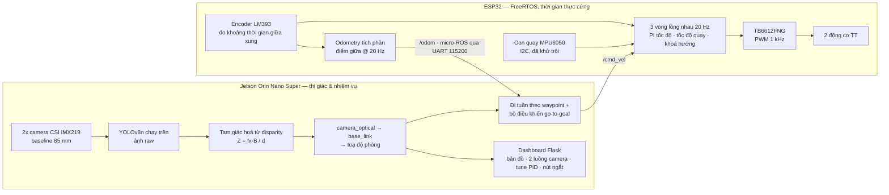

# Robot tìm kiếm cứu nạn — định vị mục tiêu chỉ bằng camera, chạy trên Jetson

> [English](README.md) (bản chính) · **Tiếng Việt**

Một robot tự hành được đặt vào góc phòng, bật lên, rồi để tự nó chạy. Robot tự đi tuần theo chu
vi phòng, quan sát bằng hai camera chụm vào trong, nhận diện mục tiêu đã được huấn luyện, tính
khoảng cách tới mục tiêu hoàn toàn bằng hình học, rồi báo cáo vị trí của nó — vừa trên bản đồ
trực tiếp, vừa dưới dạng chỉ đường tính từ đúng chỗ người vận hành đặt robot xuống.

**Không LiDAR. Không SLAM. Không có hệ định vị ngoài.** Chỉ hai module camera giá 20 USD, encoder
bánh xe và một con quay hồi chuyển.

**Sai số vị trí mục tiêu toàn hệ thống, đo khi robot đang chạy: 1 cm / 16 cm / 4 cm** tại các
khoảng cách thước đo được là 0,31 m / 0,90 m / 1,04 m.

`Jetson Orin Nano Super` · `ESP32 / FreeRTOS` · `ROS 2 Humble` · `micro-ROS` · `OpenCV` ·
`YOLOv8` · `Flask` — ~5.100 dòng Python trong 24 file, ~1.800 dòng C, 258 commit,
tháng 6–9/2026.

---

## Robot làm gì

```
 đặt robot vào góc phòng  →  đi tuần chu vi  →  phát hiện mục tiêu trên cả hai camera
        →  tam giác hoá khoảng cách  →  kết hợp với odometry ra toạ độ phòng
                  →  báo cáo vị trí trên dashboard trực tiếp
```

Một lần chạy nhiệm vụ hoàn chỉnh đã thực hiện được trên phần cứng thật ngày 06/09/2026.

<!-- TODO: chèn GIF/video demo ở đây — đây là thứ đáng bổ sung nhất cho README này -->

## Kết quả

| | Kết quả | Đo bằng cách nào |
|---|---|---|
| **Sai số vị trí mục tiêu, toàn hệ thống, robot đang chạy** | **1 cm / 16 cm / 4 cm** tại 0,31 / 0,90 / 1,04 m | thước dây, ba lần đặt khác nhau, mỗi lần chạy trọn nhiệm vụ |
| Độ chính xác riêng của đo khoảng cách stereo, robot đứng yên | ~10 % trong khoảng 0,3–1,0 m | quét thước, bốn khoảng cách |
| Chất lượng calibration stereo | sai số tái chiếu 0,33 px | `cv2.stereoCalibrate`, 20 cặp ảnh bàn cờ |
| Baseline sau calibration so với đo thực tế | 85,40 mm so với 83 mm | kết quả calibration so với thước kẹp |
| Tần số odometry / vòng điều khiển | pose 20 Hz, ba vòng lồng nhau 20 Hz, PWM 1 kHz | firmware |
| Tần số vòng xử lý ảnh | 0,54 Hz so với mục tiêu 5 Hz | đo được — con số yếu nhất của hệ thống, xem [Phase 2](docs/PHASE2_PLAN.md) |

Dòng đầu tiên mới là con số nên dùng để đánh giá dự án này: nó là con số duy nhất bao gồm cùng
lúc tất cả các lớp. Nó được báo cáo *tách riêng* khỏi dòng thứ hai một cách có chủ đích — độ chính
xác của riêng cảm biến stereo và độ chính xác của cả hệ thống là hai tuyên bố khác nhau, gộp
chúng lại là chọn số liệu đẹp. Toàn bộ số đo, kể cả những số cho kết quả xấu, nằm trong
[`docs/BENCHMARKS.md`](docs/BENCHMARKS.md).

## Kiến trúc hệ thống

Hai máy tính, chia theo đúng thế mạnh của từng bên: vi điều khiển có ràng buộc thời gian thực
cứng lo phần điều khiển động cơ, máy có GPU lo phần thị giác. Hai bên nói chuyện qua một cổng UART.



## Tớ đã xây những gì, theo từng lớp

Một hệ tự hành có bốn lớp. Dự án này xây cả bốn, ghép chúng lại, và — điều hiếm hơn — đo cả phần
ghép nối đó.

| Lớp | Đã xây | Code |
|---|---|---|
| **Thị giác (Perception)** | Calibration stereo tự làm từ đầu (chụp ảnh → `stereoCalibrate` → `stereoRectify` → bản đồ rectify); huấn luyện và triển khai YOLOv8n trên GPU của Jetson; đo khoảng cách bằng tam giác hoá disparity; một ước lượng độc lập thứ hai bằng dense stereo (`StereoSGBM` → `reprojectImageTo3D`); phép biến đổi camera_optical → `base_link` → toạ độ thế giới | [`jetson/calibration/`](jetson/calibration), [`jetson/mission/`](jetson/mission) |
| **Ước lượng trạng thái** | Odometry dead-reckoning tích phân điểm giữa ngay trên MCU; hướng được hợp nhất từ gyro qua I2C; pose publish ở 20 Hz; hệ toạ độ phòng lệch một khoảng cố định so với gốc odometry | [`esp32/motor_f1/main/motor_f1.c`](esp32/motor_f1/main/motor_f1.c) |
| **Điều khiển** | Ba vòng lồng nhau 20 Hz trên ESP32 — PI tốc độ từng bánh, hiệu chỉnh tốc độ quay, khoá hướng bằng gyro — qua PWM 1 kHz; bộ điều khiển go-to-goal theo waypoint, quay tại chỗ khi sai số hướng vượt ~50°; giảm tốc tỉ lệ khi vào cua; nút ngắt động cơ tác động thẳng vào chân standby của driver | [`esp32/motor_f1/`](esp32/motor_f1), [`jetson/mission/`](jetson/mission) |
| **Tích hợp** | micro-ROS qua UART 115200 (`/odom` vào, `/cmd_vel` ra, kèm diagnostics và chỉnh PID trực tiếp); cây TF `odom → base_link → camera_optical` đẩy sang RViz2; dashboard vận hành viết bằng Flask + canvas có bản đồ trực tiếp, pose robot, cả hai luồng camera, khung phát hiện, tune PID lúc đang chạy và nút ngắt | [`jetson/mission/search_and_rescue.py`](jetson/mission/search_and_rescue.py) |

## Những điểm kỹ thuật đáng nói

Bốn trong mười ba lần hỏng đã dạy dự án này điều gì đó. Tất cả đều đến từ phần cứng thật; bộ đầy
đủ kèm bằng chứng nằm ở [`docs/PROJECT_SUMMARY.md`](docs/PROJECT_SUMMARY.md) §4.

**Phân phối dữ liệu huấn luyện của model cũng là một phần của pipeline hình học.**
Model detect chạy rất tốt khi test một camera, rồi sụp đổ ngay khi pipeline stereo chạy thật. Đây
không phải lỗi model: nó được huấn luyện hoàn toàn trên ảnh raw còn méo, trong khi pipeline stereo
lại đưa vào ảnh đã *rectify* — tức ảnh đã bị biến đổi hình học, nằm ngoài phân phối huấn luyện.
Cách sửa là dời phép biến đổi đi chỗ khác, không phải huấn luyện lại. Giờ detect chạy trên ảnh raw,
và chỉ bốn điểm góc của khung kết quả mới được ánh xạ sang không gian rectify bằng
`cv2.undistortPoints(..., R, P)` — đúng phép rectify mà bước remap ảnh vẫn dùng, chỉ áp cho bốn
điểm thay vì hai triệu pixel. Model không bao giờ ra khỏi phân phối huấn luyện, mà phép tính
disparity vẫn nhận được toạ độ thẳng hàng epipolar chính xác.

**Độ phân giải của cảm biến có thể vô hiệu hoá mọi hệ số điều khiển.**
Bộ điều khiển tốc độ bánh xe dao động mãi không tắt. Vấn đề chưa bao giờ nằm ở tuning: RPM được đo
bằng cách đếm xung trên đĩa 20 khe trong cửa sổ 50 ms, tức RPM bị lượng tử hoá thành các bậc 60
RPM — và tốc độ mục tiêu rơi đúng vào giữa hai bậc đo được, nên bộ điều khiển chỉ đọc được ±30 RPM,
không bao giờ đọc được "đang ở đúng mục tiêu". Không Kp hay Ki nào sửa được chuyện đó. Sửa bằng
cách đổi *phép đo*: đo số micro giây giữa hai xung thay vì đếm xung mỗi cửa sổ, bỏ được sàn lượng
tử mà không phải hạ tần số vòng lặp.

**Lỗi im lặng nấp trong ngữ nghĩa của middleware.**
Message `PointCloud2` không bao giờ hiện trong RViz2 trong khi `Marker` cùng frame vẫn hiện bình
thường, và không có lỗi nào ở đâu cả. Nguyên nhân: MCU publish `Odometry` với header stamp toàn số
không, nên transform `odom → base_link` bị ghim ở "thời điểm 0" trong buffer tf2. Marker được đặt
thẳng vào frame nên không cần tra cứu; còn point cloud bắt buộc phải được biến đổi *tại đúng
timestamp của nó*, nên mọi lần tra cứu đều hỏng — trong im lặng. Bài học tổng quát: **khi một bên
dùng chung tài nguyên chạy được còn bên kia thì không, chỗ khác nhau giữa những gì hai bên *yêu
cầu* chính là chỗ có bug.**

**Dense stereo thụ động hỏng về mặt bản chất trên vật thể không có vân bề mặt.**
Dense stereo trả về ba cụm khoảng cách rời rạc lặp đi lặp lại cho một mục tiêu *đứng yên* ở 1,3 m,
trong khi tam giác hoá một điểm vẫn giữ ổn định 1,30 m từ đúng khung phát hiện đó. Nguyên nhân
không phải tuning: block matching so sánh các mảng ảnh nhỏ, mà một mảng nhựa vàng trơn thì không
phân biệt được với mọi mảng nhựa vàng trơn khác, nên bộ so khớp bám vào nền có vân ở rìa khung.
Đã chứng minh trực tiếp — vùng lõi sau khi co lại cho ra *không một* điểm khớp tin cậy nào trên mọi
frame hỏng. Chính gói Isaac ROS ESS của NVIDIA cũng ghi nhận đúng giới hạn này, và câu trả lời của
ngành là phần cứng: RealSense D435 đạt dưới 2 % ở 2 m với baseline còn *hẹp hơn*, nhờ chiếu một
mẫu hồng ngoại lên cảnh — tức là bổ sung đúng cái vân bề mặt mà stereo thụ động cần. Đây là thiếu
một năng lực phần cứng, không phải viết code sai.

## Những gì tớ đã thử rồi chủ động bỏ

Cả hai đều đã chạy thật trên phần cứng trước, rồi mới bị cắt, và lý do được ghi lại. Đây là quyết
định phạm vi, không phải chỗ còn thiếu.

| | Lý do bị cắt |
|---|---|
| **Nav2** | `RegulatedPurePursuitController` nhận goal và sinh ra plan hợp lệ nhưng im lặng không publish lấy một message `/cmd_vel`. Đã khoanh vùng đúng plugin đó bằng cách thay bằng DWB làm phép thử đối chứng — DWB chạy được ngay. Không tìm ra nguyên nhân gốc: log mức DEBUG đã bị loại khỏi bản binary cài bằng apt. Một căn phòng đã biết và có biên thì không cần lập kế hoạch đường đi trực tiếp. |
| **cuVSLAM / visual SLAM** | Lỗi tỉ lệ pose chưa giải quyết được: vị trí hoặc phân kỳ, hoặc rơi vào những dải giá trị vô lý. Đã thử và bác bỏ nhiều giả thuyết. Waypoint cố định cộng odometry hợp nhất gyro là đủ cho một căn phòng đã biết. |
| **Isaac ROS stereo depth** | Cần nguyên container Docker và một launch stereo rectify chiếm độc quyền camera, nên không thể chạy song song với phần chụp ảnh của node này — và chỉ đạt ~1–1,5 Hz trên dòng Jetson này. |

## Cấu trúc repo

```
.
├── esp32/                      # Firmware (ESP-IDF + FreeRTOS)
│   ├── motor_f1/               #   điều khiển động cơ, encoder, IMU, odometry, micro-ROS
│   └── microros_hello/         #   publisher micro-ROS tối giản (tham chiếu lúc bring-up)
├── jetson/                     # Mọi thứ chạy trên Jetson (ROS 2 Humble)
│   ├── mission/                #   node nhiệm vụ tìm kiếm cứu nạn + dashboard Flask
│   ├── calibration/            #   chụp cặp ảnh stereo, calibration, xuất camera_info
│   ├── object_detection/       #   bàn thử detect một camera
│   ├── dataset_collection/     #   quay video → tách frame → dựng dataset YOLO
│   ├── training/               #   fine-tune YOLOv8n
│   ├── slam/                   #   launch file Isaac ROS visual SLAM (đã thử, không dùng)
│   ├── nav2/                   #   Nav2 MVP vòng kín (đã thử, không dùng)
│   └── tools/                  #   công cụ chẩn đoán: log IMU, micro-ROS agent, test chạy xe
├── docs/                       # Toàn bộ tài liệu
│   ├── PROJECT_SUMMARY.md      #   đã xây gì, đo được gì, học được gì  <- đọc file này trước
│   ├── BENCHMARKS.md           #   mọi con số đo được, theo từng lớp
│   ├── FULL_REPORT.md          #   báo cáo chính thức
│   ├── PHASE2_PLAN.md          #   giai đoạn sau: chuyển perception sang GPU, đo lại trên nền này
│   └── images/                 #   sơ đồ mạch và sơ đồ khối
├── data/                       # Dataset và dữ liệu chụp (xem data/README.md)
└── archive/                    # Tài liệu đã bị thay thế, giữ lại để truy nguồn
```

## Chạy thử

Cần robot thật: Jetson Orin Nano Super (JetPack 6.x, ROS 2 Humble), hai camera CSI IMX219 đã
calibrate ở baseline 85 mm, một ESP32 ở `/dev/ttyUSB0`, và phần truyền động mô tả trong
[`docs/FULL_REPORT.md`](docs/FULL_REPORT.md) §3.

```bash
# 1. Nạp firmware (từ máy đã cài ESP-IDF + component micro-ROS)
cd esp32/motor_f1 && idf.py build flash monitor
# LƯU Ý: build hỏng KHÔNG ngăn bước `flash` nạp lại file .bin của lần build tốt trước đó --
# luôn đọc output của build trước khi tin vào kết quả chạy thật.

# 2. Dựng cầu nối ESP32 <-> Jetson (chạy trên Jetson)
./jetson/tools/start_microros_agent.sh
ros2 topic echo /odom      # xác nhận pose đang chạy trước khi làm bất cứ việc gì khác

# 3. Calibrate giàn stereo (làm lại mỗi khi động vào phần cứng giàn camera)
python3 jetson/calibration/capture_stereo_pairs.py
python3 jetson/calibration/stereo_calibrate.py

# 4. Chạy nhiệm vụ
python3 jetson/mission/search_and_rescue.py
# dashboard: http://<tên-máy-jetson>.local:8080
```

**Đặt robot cho thẳng quan trọng hơn đặt đúng chỗ.** Vị trí mục tiêu được báo cáo là vị trí tương
đối so với pose lúc xuất phát, nên phần lệch của điểm xuất phát bị triệt tiêu chính xác — đặt lệch
5 cm không ảnh hưởng gì cả. Nhưng lệch *góc* thì không triệt tiêu và không sửa được, vì gyro lấy
mốc hướng 0 tại đúng góc mà robot được đặt xuống: ở tầm 1,7 m, lệch 5° khi đặt làm mục tiêu báo
cáo dịch đi ~15 cm. Hãy đo từ tường bên tới mép trước và mép sau của khung xe rồi chỉnh cho bằng
nhau, đừng căn bằng mắt.

## Tài liệu

| Tài liệu | Dùng để làm gì |
|---|---|
| [`docs/PROJECT_SUMMARY.md`](docs/PROJECT_SUMMARY.md) | Bản tổng hợp: kết quả, dữ liệu đằng sau kết quả, mười ba bài học kỹ thuật. **Đọc file này trước.** |
| [`docs/BENCHMARKS.md`](docs/BENCHMARKS.md) | Mọi con số đo được, theo từng lớp, có đánh dấu đo thật / chỉ là giá trị cấu hình / chưa từng đo. |
| [`docs/FULL_REPORT.md`](docs/FULL_REPORT.md) | Báo cáo chính thức, gồm cả phần cứng và đấu nối. |
| [`docs/PHASE2_PLAN.md`](docs/PHASE2_PLAN.md) | 11 tuần tiếp theo: thay perception chạy CPU bằng stack GPU của NVIDIA và đo chênh lệch so với nền này. |
| [`archive/README_devlog.md`](archive/README_devlog.md) | Nhật ký làm việc gốc theo ngày — mọi bug, nguyên nhân gốc và ngõ cụt, ghi ngay lúc nó xảy ra. |

## Hiện trạng và các giới hạn nói thẳng

Hệ thống chạy được và đã đo từ đầu đến cuối. Những chỗ còn thiếu, ghi ra chứ không giấu:

- **Chưa bao giờ đo độ trôi odometry sau một vòng**, cũng chưa đo độ lệch ngang khi đi thẳng hay
  độ chính xác khi quay sau bản sửa. Ước lượng trạng thái và điều khiển — hai lớp mà mọi thứ khác
  đứng lên trên — lại là hai lớp ít số liệu nhất, trong khi perception, lớp *cảm giác* khó nhất,
  lại được đo kỹ nhất. Đáng nói ra, vì đứng từ bên trong rất khó tự thấy thiên lệch này.
- **Mọi con số đều chỉ từ một lần đặt robot**, không phải trung bình qua nhiều lần lặp.
- **Vòng xử lý ảnh chạy 0,54 Hz** so với mục tiêu 5 Hz; dense stereo tốn ~1 giây/frame trên CPU.
  Đóng khoảng cách đó chính là mục tiêu của [Phase 2](docs/PHASE2_PLAN.md).
- Model detect chưa từng được đánh giá chính thức trên tập holdout có nhãn.

## Về tác giả

Thực hiện bởi **Ngọc Giang (vịt)** — ngành CS/Kỹ thuật, Đại học Fulbright Việt Nam — tháng 6–9/2026.

Dự án hai người, chia việc theo tiêu chí công việc đó có cần đụng tay vào robot thật hay không: tớ
phụ trách toàn bộ phần tại chỗ (firmware, bring-up phần cứng, calibration, tune PID, node nhiệm vụ
và pipeline thị giác); bạn cùng nhóm Alex làm từ xa phần cấu hình, công cụ và tài liệu.

📫 giang.hoang.230105@student.fulbright.edu.vn
